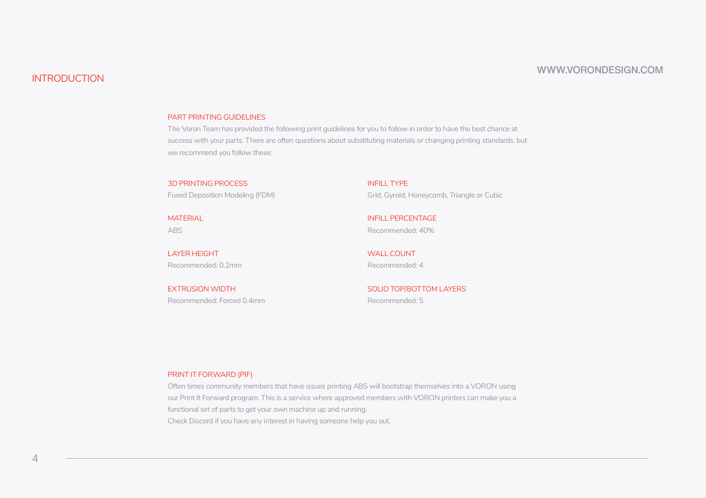

# 2. Printed parts and preparation

**Prerequisites:** I1 size gate; parts inventory; disconnected hardware.
**Tools:** calibrated ABS printer or PIF parts, deburring tools, insert soldering
tool, hex drivers 1.5–4 mm (ball ends for access, straight ends for final fastening),
calipers, square, straightedge, lubricant approved by the rail manufacturer,
threadlocker compatible with metal joints. Keep solvent/threadlocker off plastics.

## P1 — print only parts with a resolved interface

**Parts and quantities:** the [printed-parts matrix](../reference/printed-parts.md)
enumerates filenames, planned quantities, pinned sources and dispositions. Quantity
suffixes describe piece counts, not the number of download files. Core printed
parts are retained; CNC-replaced files are explicitly omitted. Do not print every
file under `STLs/`: that includes other sizes and alternate boards.

1. Use upstream p4: ABS, 0.2 mm layers, forced 0.4 mm extrusion width, 40% infill,
   four walls and five top/bottom layers. Use Grid, Gyroid, Honeycomb, Triangle
   or Cubic infill. Honor a component's own documented guidance where different.
2. Print the four Z drives, retained skirts/panel mounts and rail alignment tools
   first. Sort mirrored A/B parts into two of each; do not substitute an MGN9
   X carriage for the R2 MGN12 design.
3. Audit LDO-provided parts against the actual carton. The Rev D supplement lists
   brackets, DIN clips, spacers and a clear PETG LED diffuser as provided, but
   its Nitehawk references target original SB. Verify V2 parts against its own
   repository before assuming the old cover/adapter mount fits.
4. **OMIT** plastic A/B drives, front-idler stacks, XY-joint halves, stock Z upper
   tensioners, all four stock Z-joint assemblies (upper/lower print types) and
   all stock Z belt clips; CNC subassemblies
   supply the resolved replacement functions. **OMIT** stock inductive probe
   retention and nozzle Z-endstop printing for this path.
5. **STOP before printing the UHF hotend housing/duct.** The official standard
   Rapido v2 housing is HF. Follow T1/T2 in [toolhead](06-toolhead.md) to verify
   the Fiber UHF adapter and airflow/nozzle geometry with the CNC mount.
6. **STOP before printing the replacement XY endstop support.** The Vitalii
   download contains STEP models rather than print-ready STL instructions.
   Resolve PCB revision, dimensions, export and fit at M6 in [motion](04-motion.md).
7. Test inserts on the retained practice print. Install the inserts shown in
   the relevant stock figure only in retained plastic parts; threaded CNC holes
   do not accept stock heatset inserts. Clear the built-in skirt supports
   shown on upstream p211. Ensure bearing/rail interfaces are free of debris.

Completion: print list marked obtained/printed/blocked; no incompatible stock
part prepared for installation; fasteners counted by type and length, not just
diameter. The matrix's `included_by_ldo` designation is a BOM claim until counted.

Sources: original manual pp4–10,31; [LDO Rev D print supplement](https://docs.ldomotors.com/en/voron/voron2/printed_part_guide_rev_d),
[LDO supplement repository](https://github.com/MotorDynamicsLab/LDOVoron2/tree/8270e8cf6c7ba29a7fd11d143c287bd3af576934).
