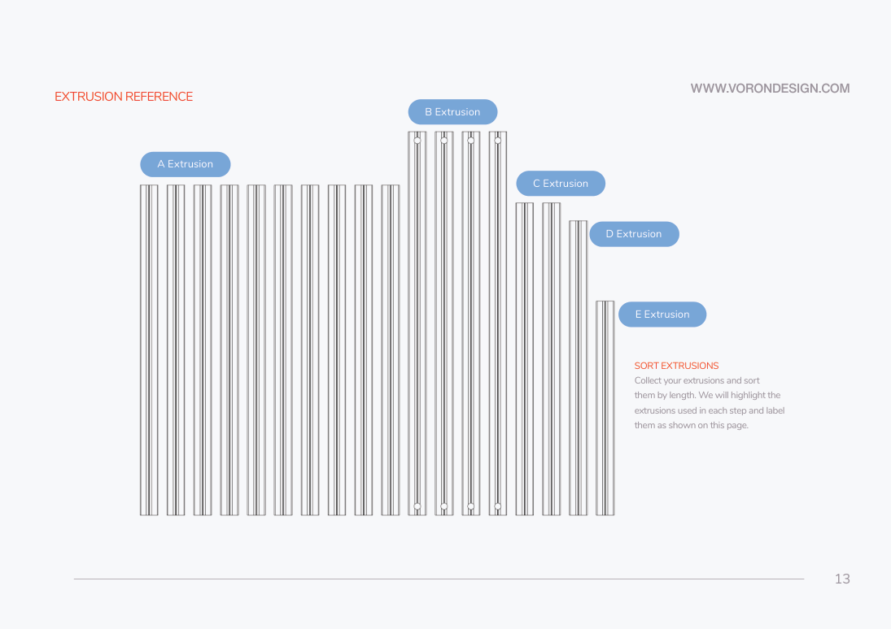
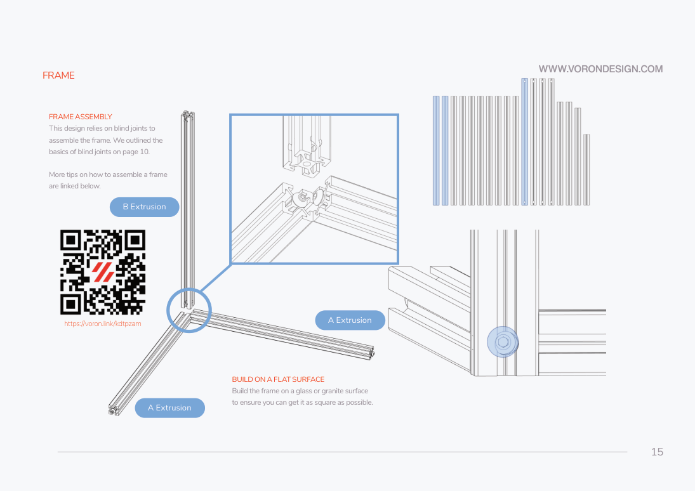
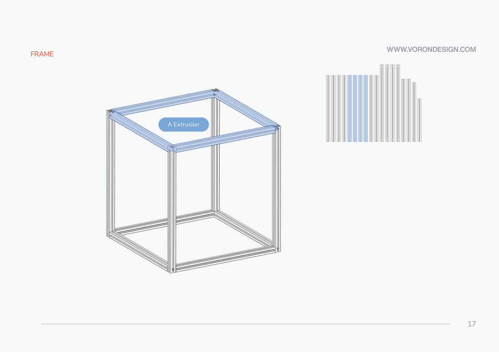
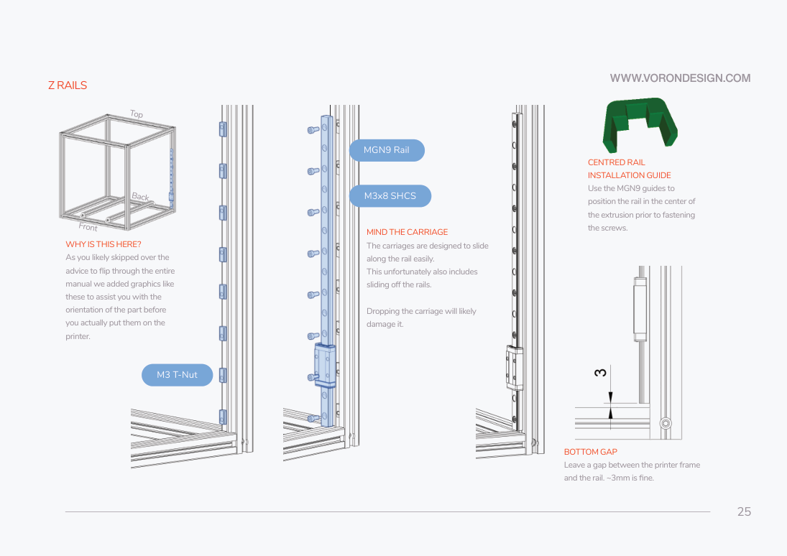
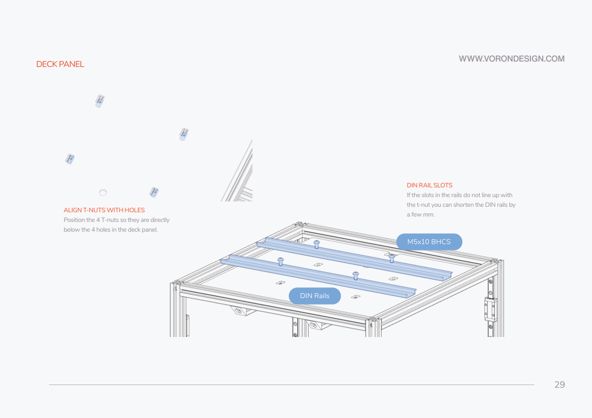
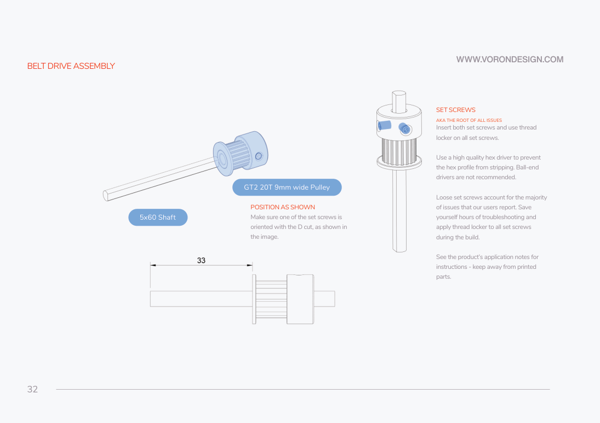
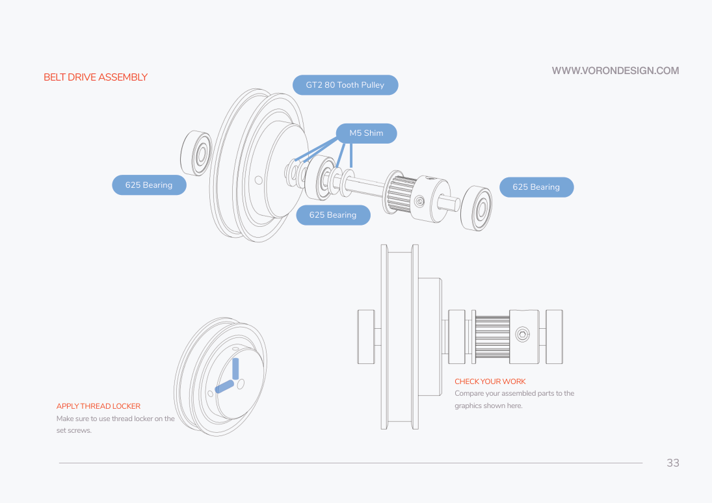
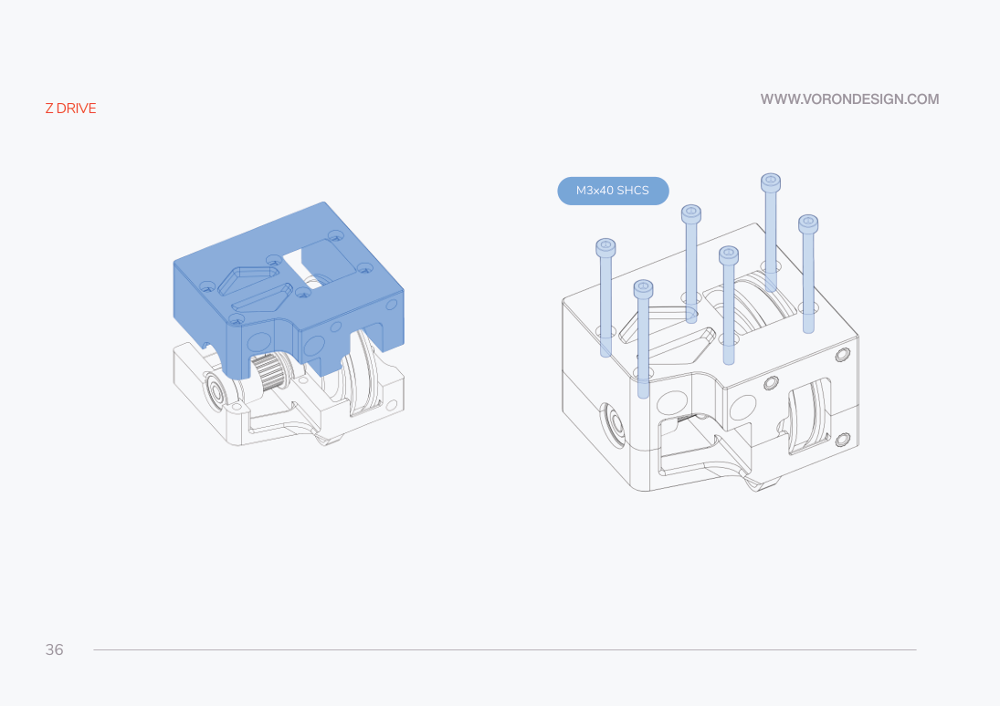
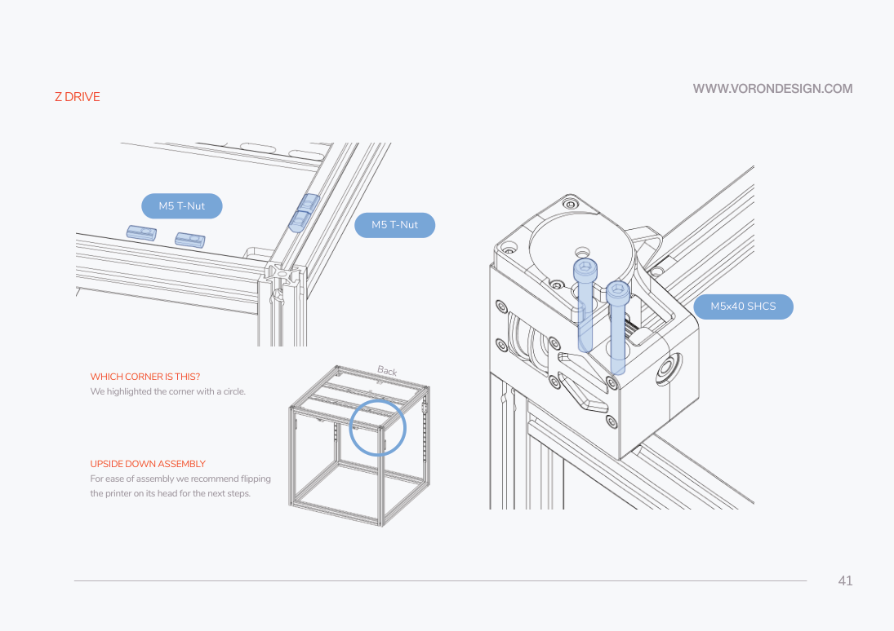
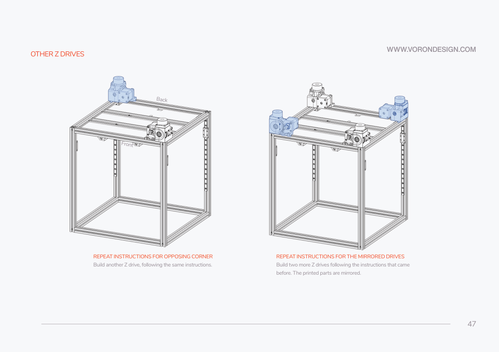

# 3. Frame, Z rails, deck and Z reduction drives

**Prerequisites:** I1 size gate closed; retained Z-drive prints prepared; rails
identified. Keep the printer disconnected throughout this chapter.
**Tools:** flat reference surface, square, ruler/calipers, 2.5/3/4 mm drivers,
rail guides, rail lubricant, metal-compatible threadlocker and insert tool.

## Frame — KEEP with a bed-support gate

**Parts, provisional 350:** ten A extrusions 470 mm (eight for cube, two bed
supports), four B 530 mm, M5x16 BHCS (16 blind-joint screws for eight frame A
pieces; four for the bed brackets), four bed corner brackets, four M5x10 BHCS
and four M5 T-nuts at the bracket/frame interfaces. The kit's C/D/E extrusions
belong to the gantry. These dimensions are the Rev D BOM lead, not shipped proof.

1. Sort and label extrusions as p13 shows. Confirm tapped ends and access holes.
   Test-fit roll-in nuts now: LDO warns that extrusion/nut tolerances may make
   preloading necessary. Remove burrs without damaging rail seating surfaces.
2. Start M5x16 BHCS in both ends of eight frame A pieces, p14. Leave the heads
   proud enough to enter the adjoining slots. Assemble blind joints by inserting
   heads into slots and tightening through the access holes, p10/p15.
3. On the flat surface, join two A pieces and a B vertical as p15 shows; add
   the remaining bottom-square A pieces and four B verticals, p16. Keep the
   access holes usable. Fit the upper four A pieces, p17. Check the faces and
   diagonals before final tightening. No torque is specified here.

### F1 — settle the Wings support layout before fixing bed extrusions

**REPLACE** stock p20's 130 mm support-spacing instruction with the resolved
MRW/Wings layout in [bed](05-bed.md). The stock drawing uses two front-to-back
supports and stock mounting holes; Wings use different plate holes. Do not lock
those supports at the stock positions or drill the deck until B2/B3 is closed.
After loosely fitting the supports in step 4 below, perform
[bed identification and the B2/B3 cold support dry-fit](05-bed.md) before
final deck/DIN installation; heater installation remains later.
The deck/DIN screws anchor into these supports, so verify that their fixed deck
holes agree with the resolved support spacing. If they do not, obtain a documented
replacement deck layout before fastening. Do not improvise slots or lock the
supports against the Wings layout merely to reuse the stock holes.

4. Prepare the two bed A extrusions with corner brackets, four M5x16 BHCS in
   total, p18. Insert the four M5 T-nuts in the frame and loosely fit the four
   M5x10 bracket screws, p19. LDO substitutes its 1 mm brass precision spacer
   for the stock M5 shim **only at retained stock interfaces**. Keep these bed
   supports adjustable until the bed support geometry is verified.
5. Square all six frame faces and compare diagonals, p21. Correct twist while
   the frame is unloaded. Record measured diagonals locally. Recheck after the
   bed-support gate and final bed-support tightening.

Completion: cube square and untwisted, blind joints accessible, supports labeled
provisional if their gate is open; no CNC assembly received stock spacer assumptions.

## Z rails and deck — KEEP, measure the actual panel

**Parts:** four MGN9 Z rails/carriages (400 mm in the provisional BOM); M3x8
SHCS and M3 roll-in nuts at the alternating mounting holes shown on p25, one
of each per occupied hole (count actual rail holes before taking hardware); two
MGN9 guides; one deck panel, two DIN rails, four M5 T-nuts/four M5x10 BHCS;
eight deck supports selected for the actual panel thickness.

### F2 — panel thickness differs between the supplementary documents

The FAQ/print supplement says 4 mm deck; the retrieved Rev D BOM calls the deck
3 mm and the bottom panel 4 mm. Measure the shipped deck. Use
`deck_support_4mm_x8.stl` only for 4 mm; use the 3 mm file for 3 mm. This is
a source discrepancy, not permission to force the wrong clips onto a panel.

1. Follow rail preparation p24 and the rail maker's lubrication instructions.
   Secure carriage stops before changing orientation. Never slide the carriage
   off to clean the rail or let its ball bearings escape.
2. Center each Z rail on the inner vertical face with the MGN9 guides, p25.
   Keep approximately 3 mm clearance above the bottom frame as shown. Install
   screws center-outward in the selected alternating holes. Keep the rail flat;
   do not use a screw to draw a bent rail onto the extrusion.
3. Mirror all four rails inward as p27 shows. Test each carriage over its whole
   safe rail length by hand; it must not catch or change resistance abruptly.
   Leave temporary rail stops installed until rigid Z joints retain the carriages.

4. **STOP here if F1 is open:** keep the deck removable and unfastened; do not
   close the lower assembly around an unresolved support layout. Bench assembly
   of the lower Z drives may continue independently. Before the deck obstructs
   access, preload the verified bed-support nuts and
   install the chosen deck support clips. Fit the deck with its notch toward
   the back, p28. Keep bed-wire pass-through accessible to the final bed cable
   route; do not apply stock p60's wire-hole coordinate to the Wings assembly.
5. With carriages positively secured, invert the frame to fit DIN rails beneath
   the deck. Align four M5 T-nuts to the four holes, attach rails with four
   M5x10 BHCS, p29. Keep the slot openings accessible for electronics service.

Completion: four smooth captive carriages, panel supported without sag, deck
notch rearward and bed/cable access retained. Do not install the stock bed.

## Four lower Z reduction drives — KEEP

**Parts, totals for four:** two each mirrored drive main/retainer/motor
mount/baseplate/tensioner print; four 5×60 mm shafts, four 20T **9 mm** shaft
pulleys, four 80T **6 mm** reduction pulleys, twelve 625 bearings, eight M5
spacers, four 188 mm × 6 mm closed loops, four Z motors, four 16T **6 mm**
motor pulleys, four M5 nuts, twenty-four M3x40 SHCS for main housings,
twelve M3x8 SHCS for retainers, twelve M3x8 SHCS for motor mounts (three
per motor in p39), eight M5x40 SHCS, eight M5x10 BHCS and sixteen M5 T-nuts for frame
attachments, four rubber feet/four M5x16 BHCS. Check the actual retained print
against the figure before issuing screws; do not transfer these
counts to CNC A/B mounts.

1. Install inserts in the retained plastic Z-drive parts as p31 shows. Make
   two A and two mirrored B drives; do not reverse them to avoid cable exits.
2. Position the 20T/9 mm pulley on the 5×60 shaft as p32 shows: the drawing's
   33 mm dimension is from the long exposed shaft end to the outer pulley flange
   face on that side, not the hub or tooth centre. One set screw meets the D-flat.
   Use the specified metal threadlocker
   on set screws, keeping it away from plastic and bearings.

3. Build the 625/spacer/80T assembly in the exact p33 order. LDO's 1 mm brass
   precision spacer replaces the stock M5 shim at this retained interface.
   Use one spacer on each side of the middle 625 bearing (two per drive).
   Compare the side view; all three 625 bearings per drive must sit in their
   intended pockets. Set screws must not rub the housing.
4. Place the 188 mm closed loop in the body **before** closing it, p34–35.
   Align the shaft/bearing assembly to p35. Close the main housing with six
   M3x40 SHCS per drive, p36. Fit the retainer and M5 nut with three M3x8
   SHCS, p37. Verify the closed loop remains captured and turns smoothly.

5. Fit each motor's 16T/6 mm pulley, p38. These four motors are the only place
   this build uses 16T motor pulleys. Align its tooth plane with the 80T pulley
   and closed loop; pulley hub orientation may differ with the actual motor.
   Set one screw on the flat and secure both. Mount the motor in the orientation
   on p39 so its cable exits clear the frame. Engage the closed loop before
   closing the stock lower-drive tensioning latch.
6. Support and invert the frame, p40–41. Preload four M5 nuts per drive as
   illustrated; fit two M5x40 SHCS. Fit the two M5x10 BHCS loosely at the base,
   p42–43, close the lower drive latch, p44, then secure frame screws and the
   foot with M5x16 BHCS, p45. Recheck drive location after latch closure, p46.
7. Repeat opposing and mirrored corners, p47. Turn each drive gently by hand
   and check closed-loop alignment and free shaft rotation. Label all four
   motor cables by their physical corners without assuming software Z order.

**REPLACE** upper Z idler/tensioner assembly pp48–50 with purchase 12 at the
start of [motion](04-motion.md). Retain the lower reduction latch just assembled:
it tensions the short 6 mm loop; the new upper unit tensions the long 9 mm Z belt.

Completion: four correctly mirrored lower drives, short loops free and aligned,
rail stops retained, no stock upper tensioner built, gantry not yet suspended.

Sources: original manual pp10,13–50 (all printed page numbers; PDF index = p−1),
[LDO FAQ](https://docs.ldomotors.com/en/voron/voron2/build-faq),
[LDO Rev D BOM](https://docs.ldomotors.com/en/voron/voron2/350_BOM/Rev_D).
