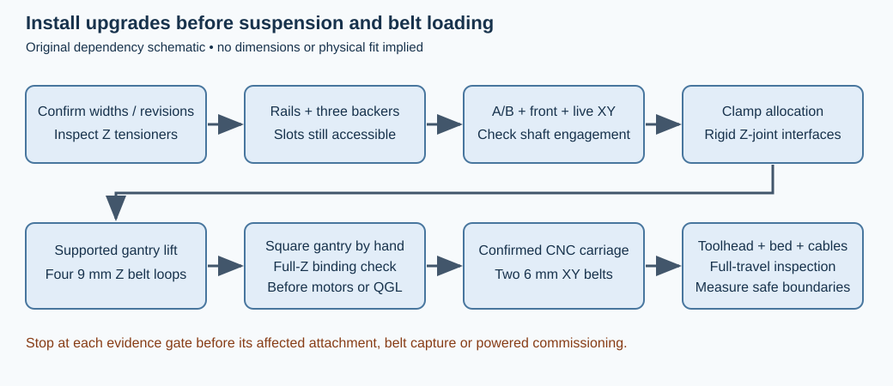
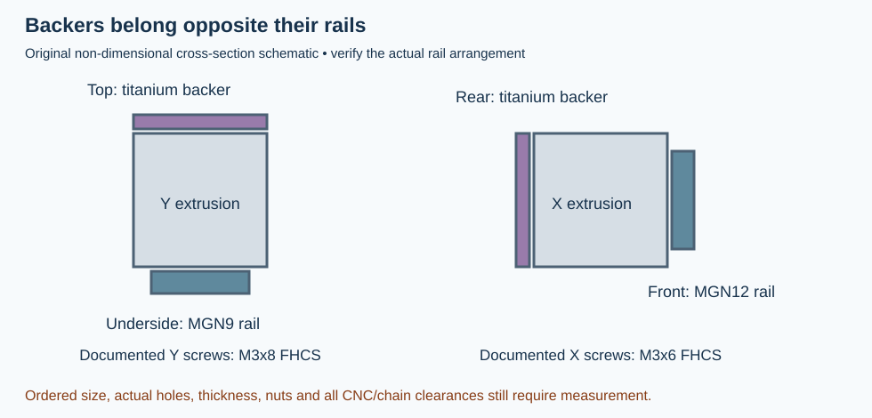
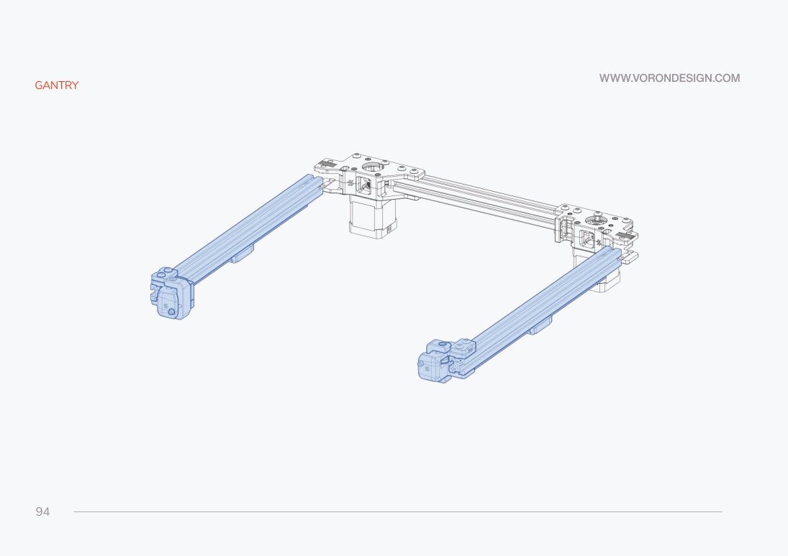
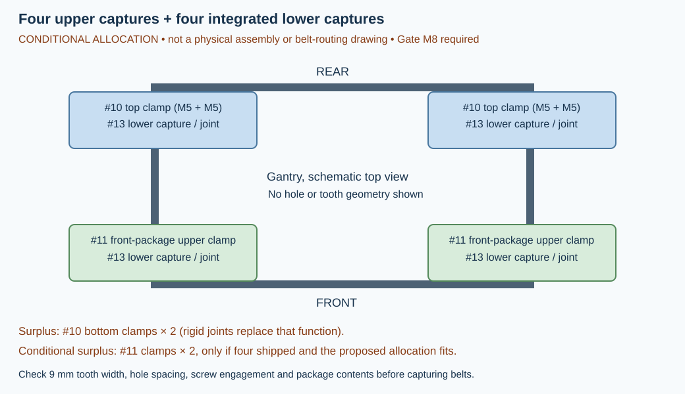
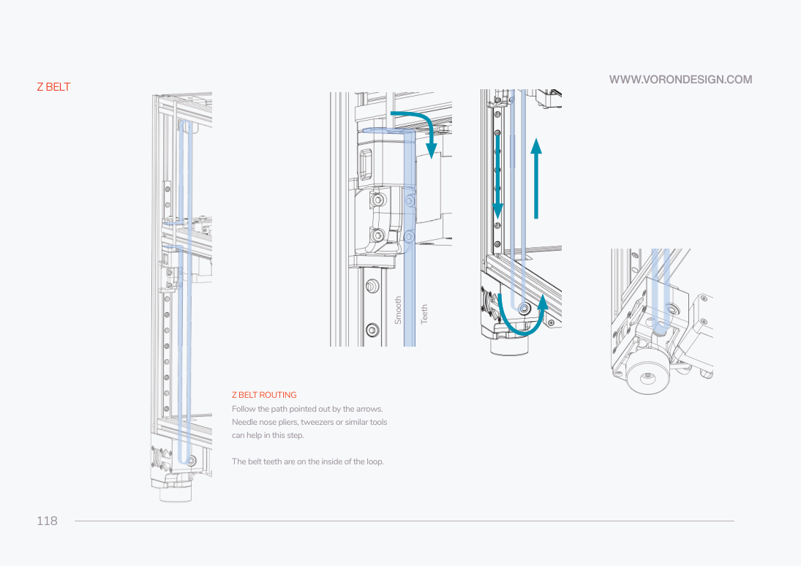
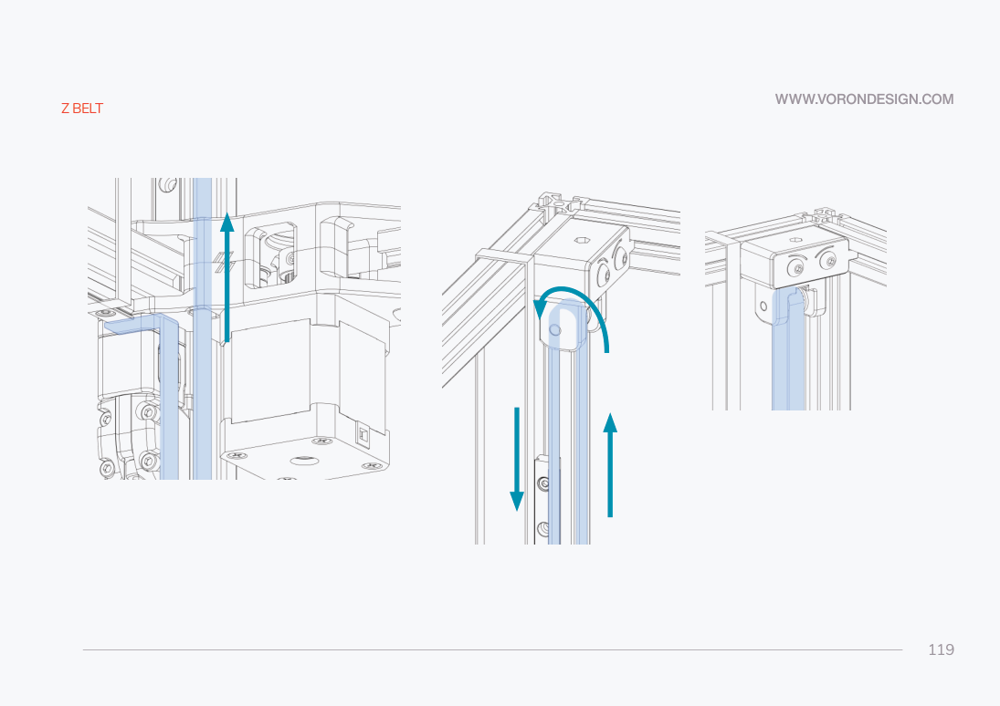
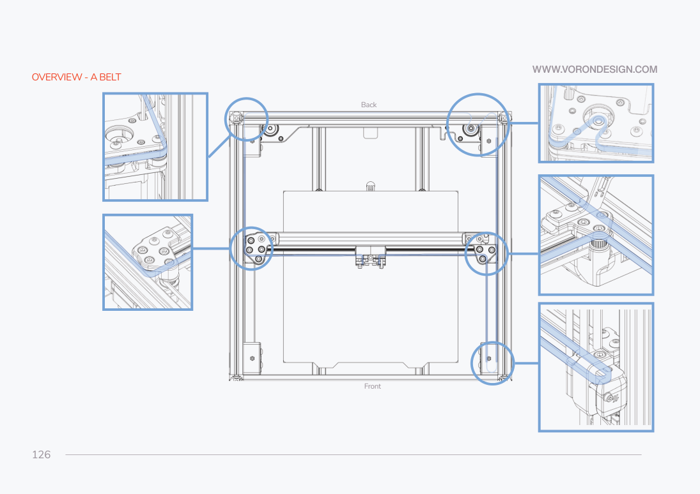
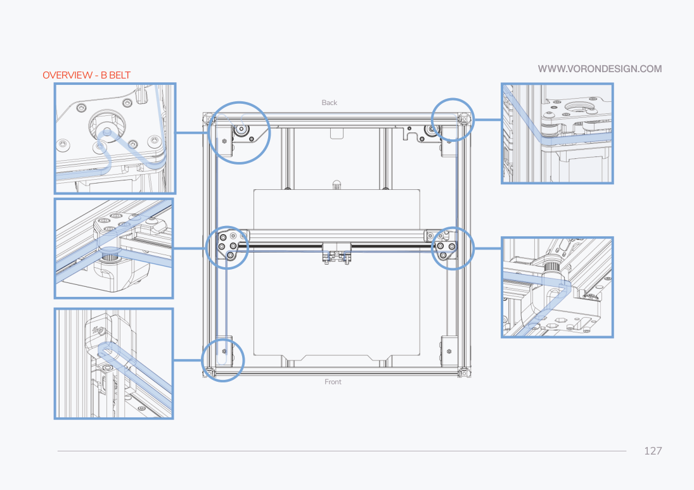

# 04 — Modified Z suspension, gantry and belts

This chapter installs purchases **02, 09, 10, 11, 12, 13 and 14** before the gantry is suspended. The planning target is a 350-class, single-front-MGN12-X / underside-MGN9-Y Voron 2.4R2 gantry. That geometry is documented by the pinned upstream manual; it still has to match the parts in the box. None of the combined CNC/backer/carriage arrangements below has been physically validated on this printer.

**KEEP** the frame, rail preparation and four lower Z reduction drives from the preceding chapter. **REPLACE** the stock upper Z idlers, A/B drive frames, front idlers, XY joints, Z joints and relevant belt clamps. **OMIT** their printed counterparts from the initial build. **ADD** the titanium backers while extrusion slots are accessible. Keep the frame open and leave the top panel off: the purchased Z tensioners adjust from above.

## M1 — Verify the motion parts before assembling their stacks

**Gate M1, blocks the affected subassembly only.** Compare the machined parts with the product-linked manufacturer PDFs, not only the store photographs. Record actual revisions, bag contents and belt widths. The governing documents retrieved on 2026-10-09 are [A/B revision 1.0](https://cdn.shopify.com/s/files/1/0680/6224/9145/files/6mm_2.4_AB.pdf), [front-idler revision 1.0](https://cdn.shopify.com/s/files/1/0680/6224/9145/files/6mm_Front_Idlers_2.4.pdf), [live-XY revision 1.1](https://cdn.shopify.com/s/files/1/0680/6224/9145/files/6mm_LI_XY_Joints.pdf?v=1757048653e), and [Z tensioners, unversioned](https://cdn.shopify.com/s/files/1/0680/6224/9145/files/Z_Tensioners_Assembly_Instruction.pdf?v=1752685029). Hashes, page mappings and conflicts are in [motion research](../data/motion-research.json).

The purchased **XY joints are the 6 mm version**. The A/B linked manual is also for 6 mm belts. The Z tensioner manufacturer independently specifies **9 mm Z belts**. The stock manual agrees: printed p.131 (PDF index 130) specifies 6 mm A/B belts, while p.111 (index 110) specifies 9 mm Z belts. Measure the kit belts and each pulley running width; do not infer Z width from XY width. A 9 mm Cartographer carriage variant would conflict with this 6 mm XY path unless the actual manufacturer documentation establishes a different arrangement.

The live manufacturer pages and assembly PDFs disagree in several places:

| Subassembly | Evidence to reconcile before use |
| --- | --- |
| A/B pair | PDF package table says seven F695 bearings; its diagrams require seven **per drive**, including the shaft support bearing. The live product listing offers fourteen. Confirm fourteen are in the purchased bearing variant. |
| Front idlers | Live page lists four M3 slot nuts, M3x16 and M3x10 mounting bolts and four clamps; PDF lists two roll-in nuts and different internal fasteners, with clamps marked add-on. Count the shipped hardware and identify its revision. |
| Live XY | PDF package table says eight ultra-low M3x3 bearing-retention screws, but procedure says M3x4. Live product text also gives differing counts. Ask for a revision-matched retention specification; do not choose a screw length by guessing. |
| Rigid Z joints | Store gives hardware quantities but no linked assembly drawing. Obtain the screw-to-hole assignment and approved gantry/rail fit from the supplied instructions or manufacturer before fastening. |

**Tools for this chapter:** quality straight hex drivers matching actual screws, two drivers for the Z tensioner axle, calipers, square, ruler/tape, needle-nose pliers or tweezers, supported work surface, rail stops/tape, four equal-height gantry supports and temporary retaining straps. Use medium threadlocker only on the metal screw joints where the relevant Vitalii PDF recommends it. Keep it out of bearings. No manufacturer torque values were found; none are invented here.

## Install the upper Z tensioners before closing the top frame

**Prerequisites:** squared frame, Z rails and lower Z drives completed; M1 confirms nine-millimetre Z belts and matching tensioners. The top must remain accessible. **REPLACE** upstream printed pp.48–50 (PDF indices 47–49), including their M5x30 / printed-idler hardware, with purchase **12**.

**Parts:** one purchased set contains four preassembled tensioners and eight M5x25 button-head screws according to the live [product page](https://vitalii3d.com/products/z-tensioners-for-voron-v2-4). The PDF lists four tensioner blocks, two left and two right fixed blocks, four 9 mm GT2 idlers, four 20 mm threaded pins, eight 0.8 mm M5 shims, eight M3x6, four M5x16 and eight M5x25 screws. Treat those internal pieces as contents of the four assemblies, not an additional set. Confirm the M5x16 frame attachment and mating T-nuts from revision-matched instructions before installation; the PDF does not depict attachment to a full frame.

**Gate M2, blocks mounting these tensioners.** Confirm the left/right corner orientation, mating frame holes/T-nuts and frame-attachment screw length against the supplied product revision. A stock plastic-idler screw is not a substitute. Check that the idler plane aligns with the lower Z-drive pulley and that a straight driver reaches the top adjuster without colliding with frame braces or later panels.

1. Inspect the four preassembled units rather than unnecessarily dismantling them. Each idler should rotate freely. The PDF's assembly leaf 4 (printed “4”, index 3) shows **one 0.8 mm shim on each side of the idler**, inside the tensioner fork.
2. If a unit was supplied loose, insert one M3x6 into the threaded axle (leaf 3/index 2), place the shim–idler–shim assembly in the fork (leaf 4/index 3), then secure the axle from the opposite side with the second M3x6 while holding the first with another driver (leaf 5 also printed “4”, index 4).
3. Join each movable block to its matching fixed block with two M5x25 screws as shown on printed p.6 (index 5). Keep sufficient adjuster engagement; the stock instruction to back a plastic adjuster out and turn it four turns is **omitted** for these CNC units.
4. After M2 is cleared, attach the two left and two right assemblies in their confirmed top corners. Start with usable adjustment in both directions. Do not use the listing's promotional suggestion of overtightening as a belt-tension instruction.

**Completion check:** four idlers turn freely; all four belt planes align with their lower drive; no screw bottoms out; adjusters remain accessible from above. Leave the nine-millimetre Z belts uncut until the suspension and clamp gates are cleared.

## Prepare the gantry rails and titanium backers while slots remain open

**Prerequisites:** M1 confirmed gantry rail types; unassembled Y and X extrusions; purchase **02** available. **KEEP** stock rail alignment/preparation on printed p.24 (index 23), p.88 (index 87) and p.101 (index 100). Rail carriages must remain on their rails and be restrained whenever an assembly is inverted. **ADD** three backers before the CNC ends and chain supports obstruct their slots.

**Parts:** one purchased three-pack, planned installation three pieces; actual ordered build-size variant is unknown. [West3D](https://west3d.com/products/titanium-backers-for-voron-2-4-trident-3-pack) describes approximately 3.2 mm thickness, twenty-two M3x8 flat-head screws and ten M3x6 flat-head screws, with approximately thirty M3 T-nuts required separately. Do not claim those T-nuts were purchased. The number actually installed equals the appropriate holes in the delivered backers, not the number of screws in the bag.

**Gate M3, blocks backer attachment and gantry end closure.** Confirm the ordered 350 build-size variant, actual strip lengths, thickness, countersinks, hole spacing and extrusion-slot clearance. The 350 variant name is a printer-size choice, not proof that the physical strip is exactly 350 mm long. Confirm T-nut type fits the actual extrusion and rail screws; account for each occupied hole. Select any cable-bridge clearance part only after confirming the actual chain/umbilical arrangement.

1. Clean/lubricate and mount the two Y MGN9 rails to the **undersides** of their extrusions using the stock rail hardware and alignment procedure. Work from the centre outward as the manual directs; restrain both carriages.
2. Install each Y backer on the **top** of its extrusion, opposite the underside rail. The [designer's pinned installation instructions](https://github.com/tanaes/whopping_Voron_mods/blob/62268ed817878e54d6a1186882060aa8368d4f0f/extrusion_backers/README.md#installation) specify M3x8 flat-head screws for Y.
3. Install the single MGN12 X rail on the **front** face as stock p.101 shows. Attach its backer to the **rear** face, using the documented M3x6 flat-head screws. Do not put this backer on top: the source explicitly warns that this is the wrong compensating side for a single front MGN12 rail.
4. Seat each countersunk screw without bowing the extrusion, check engagement and slide each rail carriage through its length. Check access for CNC fasteners and endstop wiring before adding end units. Do not drill/tap a purchased prefinished titanium strip unless its manufacturer explicitly requires that operation.

**Completion check:** all three backers are opposite their respective rails; screw heads are seated; rail travel is smooth; no fastener reaches a rail race or obstructs the mating CNC unit. Candidate designer chain bridges are `XY_cable_chain_bridge-3hole-3mm_backer.stl` and `XY_cable_chain_bridge-Igus-3mm_backer.stl` at the pinned source; their 3 mm naming does not establish fit to an approximately 3.2 mm purchased backer. They remain unresolved until the actual routing is selected and clearance is checked.

## Assemble the A/B double-shear drives and front idlers

**REPLACE** stock pp.64–80 (indices 63–79) with purchases **09** and **11**. Those pages remain stock belt-topology and motor-orientation references; their plastic-frame fasteners and stackups are not instructions for the machined parts.

**A/B parts for the pair, after M1:** four plates, four precision threaded pins, twelve 1 mm M5 shims, two 10 mm M5 sleeves, six 20 mm M3 sleeves, six cup shims, eight M3x8 flat-head screws, six M3x35 cap screws, four ultra-flat M3x4 bearing-retention screws and fourteen F695 bearings. The bearing count is a diagram-derived requirement for both complete double-shear drives, subject to the package-table conflict above. Retain two kit XY motors and two 20-tooth pulleys only after proving their fit.

**Gate M4, blocks motor installation and belt loading.** Measure each A/B motor's exposed shaft from its mounting face. With the motor plate, pulley and upper support bearing in their documented positions, prove that the shaft actually engages the support bearing's inner race and turns without bottoming, axial preload or radial misalignment. A customer review's “35 mm minimum” is a research lead, not a dimensional specification from the manufacturer. Obtain the actual required shaft/plate/pulley dimensions if the fit cannot be established. Do not substitute motors silently or claim double-shear operation with an unengaged shaft. Confirm motor-to-plate screws and thread engagement; the CNC PDF does not specify these installation screws or a numeric pulley height.

1. Match the A and B top/bottom plates to PDF leaf 2/index 1. Starting with the illustrated right-hand drive, attach its two threaded pins to the lower plate with M3x8 flat-head screws (leaf 3/index 2).
2. On the two-level smooth-idler pin, stack bottom to top: **1 mm shim → F695 flange down → F695 flange up → 1 mm shim → 1 mm shim → F695 flange down → F695 flange up → 1 mm shim** (leaf 4/index 3). On the one-level pin: **10 mm M5 sleeve → 1 mm shim → F695 flange down → F695 flange up → 1 mm shim** (leaf 5/index 4).
3. Insert three 20 mm M3 sleeves; bring the upper plate down squarely and hold it with the three M3x35/cup-shim fasteners (leaf 6/index 5). Secure the pin ends with the illustrated M3x8 flat-head screws (leaf 7/index 6).
4. **Before the next step:** the manufacturer warns that only a little force is needed on the support-bearing retainers. Seat the seventh F695 in the support recess and capture it with the two ultra-flat M3x4 screws as leaf 8/index 7 shows. Do not clamp its inner race or distort the bearing.
5. Build the other drive using leaf 10/index 9: its single bearing pair occupies the **lower** belt level. It is not a second identical stack. Rotate all idlers freely, then perform M4's motor/pulley fit check. Motor leads should have bend room and clear the moving belts.

**Front-idler parts for the pair, after M1:** two Part A plates, two Part B plates, two tensioning forks, two side pieces, two pins, four F695 bearings, four 1 mm M5 shims, two 10 mm M5 sleeves, four M3x5 flat-head screws, four M3x45 cap screws and eight M3x6 button-head screws, as PDF leaf 2/index 1 shows. Confirm its revision-dependent extrusion screws/T-nuts and clamp supply separately.

1. On each pin stack: **10 mm M5 sleeve → 1 mm shim → F695 flange down → F695 flange up → 1 mm shim** (front PDF leaf 3/index 2). Fit into the tensioning fork and retain with two M3x5 flat-head screws (leaf 4/index 3).
2. Place the fork between its Part A/Part B plates and fit the two M3x45 adjustment screws (leaf 6/index 5). Add the side piece with four M3x6 screws (leaf 7/index 6), following the PDF's medium-threadlocker recommendation for the indicated metal joints.
3. Assemble both idlers the same way; install the **left unit upside down** relative to the right as leaf 9/index 8 shows. Check free rotation across the intended adjustment range.
4. **Gate M5, blocks final gantry attachment:** confirm CNC-to-extrusion mounting screw lengths and slot-nut arrangement for the actual revision. Preserve stock extrusion alignment and flush-end references on pp.85–95, but do not transfer plastic hardware dimensions where the CNC drawings do not establish them. Dry-fit all four corner units with backers present; verify their upper/lower belt planes, clamp access and rail clearances together.

**Completion check:** both drive assemblies have the correct opposite single-idler level; both shaft supports genuinely engage; front idlers have the documented opposite orientation; every idler spins freely; no screw, backer or extrusion lip touches a belt plane.

## Assemble the revision 1.1 live-idler XY joints and endstop support

**Prerequisites:** M1's bearing-retention conflict cleared, X rail/backer installed and Y rails restrained. **REPLACE** stock pp.96–100 (indices 95–99) and their printed XY joints with purchase **14**. Mounting hardware on pp.103–106 also becomes revision-specific.

**Parts from the revision 1.1 PDF for one purchased left/right set:** four machined plates; two press-fit toothed idler shafts; two separate stainless pins; eight F695 bearings; four 1 mm M5 shims; two 20 mm M3 sleeves; four 8 mm M5 sleeves; four springs; four M3x8 flat-head screws; two M3x30 flat-head screws; six M5x10 flat-head mounting screws; eight M3x8 button-head mounting screws; eight ultra-low bearing-retention screws whose length is unresolved by the conflicting PDF text. Keep each spring and sleeve with its associated stack. Do not press the purchased idlers off their shafts.

1. Match the **right lower plate** to XY PDF leaf 3/index 2. Once the retention-length gate is cleared, fit its flanged shaft-support bearing without overtightening the two retainers. Fix the separate threaded pin with M3x8 as leaf 4/index 3 shows.
2. On that smooth-idler pin, bottom to top: **1 mm shim → F695 flange down → F695 flange up → 1 mm shim → 8 mm M5 sleeve → spring** (leaf 5/index 4). On the adjacent rotating shaft axis fit **spring → 8 mm M5 sleeve → press-fit toothed-idler shaft** (leaf 6/index 5), seated in the lower support bearing.
3. Insert the 20 mm M3 sleeve, position the top plate and start M3x30 without fully tightening (leaf 7/index 6). Align the top, secure the pin with M3x8, tighten M3x30, and fit the upper shaft-support bearing retainers (leaf 8/index 7). Observe the manufacturer's low-force warning.
4. Build the left joint using the **reversed vertical levels** in leaf 10/index 9, not by making an identical right joint. Both smooth and toothed idlers must turn freely after retaining the bearings.
5. Set aside the completed left and right joints for the gantry-extrusion steps immediately below. Mount them to the X extrusion and Y carriages only after M5 establishes the revision-specific screws. Use the PDF's listed hardware where confirmed; do not install stock M5x40 plastic-idler bolts. Leave alignment fasteners adjustable until the gantry is manually squared.

**Gate M6, blocks endstop installation and XY homing.** Identify the actual LDO X/Y endstop PCB, connector orientation and mounting-hole pattern. Vitalii's linked [supporting-parts archive](https://cdn.shopify.com/s/files/1/0680/6224/9145/files/Live_Shaft_XY.zip?v=1779734631) contains **STEP CAD only**, not printable STLs: `Endstop_PCB_Mount_heat_inserts.step`, `2x_PCB_Spacer.step`, `Endstop_Bump.step`, `Endstop_Bump_Deep.step`. No print orientation, fastener/insert specification or reuse license was found. Obtain/select a matching printable export and approved hardware after checking the actual PCB and its trigger position. The deeper bump is an unresolved alternative, not an additional mandatory part. STEP filenames establish what was supplied; no geometric STEP fit validation was possible with the available tools.

**KEEP** separate X and Y endstop functions for this build; **REPLACE** the stock printed PCB/pod mount procedure on pp.162–164 (indices 161–163) with the confirmed CNC-compatible support. The stock right-XY-joint's probe-wire channel and stock Hall magnet pockets are not present by assumption. Do not tape a PCB into the belt path. Cartographer changes Z sensing, not automatically X/Y switches.

The selected **X authority is the physical switch on the CNC carriage**, after
T1 verifies its bracket, cable and trigger target. The selected **Y authority is
the confirmed Vitalii-compatible Y switch/PCB support**, after M6 verifies its
rear trigger geometry. If a combined LDO XY PCB is retained for Y, leave its
X channel unused and omit that duplicate X configuration. Confirm the carriage
X-switch bump on the right live joint and Y trigger at the rear before homing;
the supplied STEP models do not establish those interfaces by themselves.

**Completion check:** both assembled joints turn freely; left/right belt levels differ as drawn; shaft bearings are retained without drag. Once mounted in the following gantry steps, the endstop support must clear the backer, belts and carriage through travel. Homing remains blocked until M6 is cleared and wiring/configuration agrees.

## Join the gantry extrusions to the modified corners

**Prerequisites:** rails/backers prepared above, four CNC corners assembled, M4 and M5 cleared. **Parts:** two remaining **C** extrusions for the Y beams, one **E** rear crossmember, one **D** moving X beam, two MGN9 Y rail/carriages and one MGN12 X rail/carriage. These letter assignments follow the actual manual's p.13 reference, p.85 rear crossmember, p.88 Y beams and p.101 X beam. Match their lengths to the confirmed kit-size/batch cut list; the manual drawings do not provide a universal 350-kit cut list. Use the verified CNC mounting screws and mating slot nuts from M5, not a new copy of the stock plastic parts' hardware.

**KEEP** the outer printer frame's already installed M5x16 blind-joint screws from the preceding frame chapter. The gantry steps below use the corner plates and extrusion slot nuts, not a second set of frame blind joints. For comparison, the stock rear assembly on pp.85–87 uses eight M5 slot nuts/M5x10 button-head screws; stock pp.91–95 uses M5x16 in its gantry-corner and upper-clamp interfaces. Those stock dimensions are **not verified CNC replacement screw lengths**.

1. Lay the **E rear crossmember** between the two completed A/B drives, with **B at rear left and A at rear right when viewed from the front**, as p.83/index 82 identifies. Stage the appropriate CNC slot nuts before covering the extrusion ends. Seat the crossmember in the plate interfaces without twisting either corner, then start its M5-interface fasteners only after M5 confirms their actual specification. The views on pp.85–87 show this rear crossmember relationship.
2. Bring the two **C Y beams** forward from those rear corners, parallel to one another. Their MGN9 rails remain on the **undersides**, with backers on top. Stage the extrusion nuts needed for both CNC-corner attachment and the eventual Z belt captures before access closes; pp.89–90 show why both sides of the stock slots need early access. Determine the CNC count/position from M5/M8 rather than copying a stock plastic clamp's nut order.
3. Fit the front-idler units to the front ends of the C beams: front-left inverted relative to front-right, as the manufacturer front-idler PDF specifies. Seat all four C-beam ends at their confirmed CNC datum surfaces. Compare the resulting rear-E / two-C U-shaped assembly to the stock layout on p.94. Check equal diagonals and parallel Y rails; leave alignment fasteners adjustable. Install upper clamps only after M8 is cleared.

4. Prepare the moving **D X beam** with its MGN12 rail facing the printer front, its titanium backer behind and its carriage restrained. Fit the completed left and right live XY joints to the D-beam ends as p.103's arrangement shows. The revision 1.1 XY PDF lists six M5x10 flat-head and eight M3x8 button-head mounting screws; their assignment to the actual D beam and actual Y carriages must be established at M5. **REPLACE**, rather than copy, the stock p.104 M5x10/M5x16/M5x30 button-head stack and washers.
5. Tilt the completed D-beam/live-joint assembly into the U-shaped gantry and align each joint to its Y carriage, following the access concept on p.106/index 105. Support it while engaging the confirmed CNC-to-carriage screws. Do not use the stock “two bolts only” instruction or M3x16 length for the CNC part: the actual PCB support must be reconciled at M6. Move X slowly through Y travel, checking parallelism and that the joints do not lift or distort either carriage. Final squaring happens on supported suspension before belt tension is applied.

**Completion check:** one E rear beam, two C side beams and one moving D X beam are present; A is rear right, B rear left; both Y rails face downward and the X rail faces forward; corners meet their verified mounting datums; rail carriages move without a forced fit; the assembled gantry is square before tightening the remaining alignment fasteners.

## Allocate the clamps and install rigid Z joints before suspension

**REPLACE** stock printed pp.110–116 (indices 109–115) with purchase **13**. **OMIT** stock upper/lower Z-joint plastic parts, spherical joint stack and separate lower belt clips. [Vitalii's rigid-joint page](https://vitalii3d.com/products/rigid-fixed-z-joints-for-voron) explicitly says the complete stock joint and **bottom belt clamp** are replaced. A lower purchased CNC clamp must not be stacked onto that integrated lower function.

**Parts:** one purchased rigid-joint set is four joints, sixteen M3x8, four M3x14 and four M5x14 screws according to the listing. The actual head types and screw-to-hole assignments need revision-matched installation evidence; the store BOM alone is insufficient. Four equal-height supports and temporary straps are essential while the gantry is unpowered.

**Gate M7, blocks rigid-joint fastening and cutting Z belts.** Obtain the actual product installation drawing or supplied instructions confirming: rail carriage compatibility, orientation, which supplied screws mount each interface, integrated belt-capture geometry, allowed adjustment and fastener engagement. Confirm that the machined corners can be squared without forcing the four rail carriages into misalignment. No rigid-joint installation PDF/CAD was linked on the retrieved product page.

Purchase **10** is one four-piece set, **not four upper clamps**: [the manufacturer lists](https://vitalii3d.com/products/voron-v2-cnc-belt-clamps) two **M5+M5 top** clamps and two **M5+M3 bottom** clamps. Purchase **11** separately lists four machined clamps. The proposed disposition uses the separately purchased tops at the rear and the front-idler clamps at the front, retaining every purchase in the manifest:

| Piece source | Conditional planned installation | Planned surplus if verified |
| --- | --- | --- |
| #13 rigid joints | Four complete rail/gantry joints with four integrated lower belt-capture functions | No redundant stock joint or lower clip installed |
| #10 top clamps | Two at the rear A/B upper capture interfaces | Zero |
| #10 bottom clamps | Zero: rigid joints occupy the lower function | Two |
| #11 clamps, if all four shipped | Two at the front upper capture interfaces | Two |

**Gate M8, blocks belt capture.** This allocation is **conditionally compatible**, not fit-tested. Physically verify tooth width for nine-millimetre Z belts, hole spacing, upper/rear/front plate interface, stock extrusion-slot access and screw engagement; reconcile the front-PDF “add-on” note with the delivered package. If a #10 top does not fit a rear CNC drive, do not force it or silently replace it: update the disposition and obtain a documented matching clamp. Actual installed quantities remain unset until checked.

After M7/M8 are cleared, seat the four rigid joints against their matched Z carriages with their approved screws, align the gantry on equal-height supports, and capture one end of each nine-millimetre Z belt in its integrated lower interface. Keep belt teeth engaged in the confirmed serrations. Hoist the gantry past the uprights with help, using straps as stock p.114 (index 113) recommends. Finalize the joint/gantry interfaces only while the gantry is square and supported. Preserve access to the upper clamps.

**Completion check:** there are exactly four lower and four upper Z capture locations; no redundant bottom clamp; all four carriages sit naturally on their rails; all joints are secure without a forced twist. Surplus pieces are bagged and labelled by purchase ID.

## Route the Z belts, square by hand, then route A/B belts

**Prerequisites:** M1–M5, M7 and M8 cleared for the affected assembly; gantry securely supported. M6 continues to block endstop mounting/homing but does not prevent independent bare-gantry preparation. Before the A/B belting step, complete the **bare CNC carriage identification, rail mounting and belt-capture preparation** in [the toolhead chapter](06-toolhead.md), with its six-millimetre variant confirmed. The Rapido, extruder and ducts can be fitted later; do not build a stock carriage or require a complete hotend simply to thread the belts. **KEEP** the functional Z loops in stock pp.118–121 (indices 117–120) and stacked CoreXY topology pp.125–127 / pp.132–138 (indices 124–126 / 131–137). These are stock reference drawings, not pictures of the modified CNC assembly.

1. Route each nine-millimetre Z belt from its confirmed lower capture around the lower Z-drive pulley and upper purchased tensioner idler, then back to its confirmed upper capture. Keep **teeth inward** around the toothed elements, no twists, and the two vertical runs parallel. The rendered diagrams on pp.118–119 show the loop. Check alignment before securing the upper end; retain service slack, fold excess clear of travel and secure it as p.120 depicts. Repeat four times.
2. Bring all four supports to equal height and manually square the gantry. Stock p.122 (index 121) uses the rear drive stops to square X relative to Y; CNC housings must first provide matched contact geometry. Check with a square and diagonals as well. Adjust mounting alignment rather than using rigid joints or high belt tension to force the frame square.
3. **Gate M9, blocks powered Z motion and quad gantry leveling.** With the gantry retained against falling and motors disconnected from powered control, slowly inspect its usable Z travel by supporting it at all four corners. Move without forcing a corner to lead. Stop for binding, carriage lift, unequal belt tracking or a twisted rail. Recheck at low, middle and high positions. Re-align rails/joints and recheck; a QGL macro cannot repair binding from rigid joints. Keep temporary support until the belts safely support the gantry.
4. Set the front CNC XY tensioners within their confirmed adjustment range. **OMIT** stock p.128's printed-adjuster four-turn preparation. Capture the first ends of the two six-millimetre A/B belts using the **confirmed CNC carriage** procedure; **REPLACE** stock pp.129–131 and pp.139–141's printed carriage hardware with that procedure. Do not assemble stock printed belt-capture halves first.
5. Trace belt **A** through the full upper/lower plane shown on pp.126 and 132–135, and belt **B** through its separate plane on pp.127 and 136–138. At every smooth F695 pair the smooth back contacts the idler; the toothed surface contacts the motor pulley/live toothed idler. Follow both paths with a finger or pointer before cutting. The manual's topology avoids a crossed-belt arrangement; do not add a crossing to imitate another CoreXY design.

6. Do not remove a CNC structural pin or bearing retainer to follow the stock tip about removing M3x40. Use tweezers and leave accessible covers off until belting is complete. Verify belt-plane heights at A/B pulleys, front idlers, live joints and carriage captures **as one system**. No numeric CNC pulley height was documented. Cut only after adequate carriage engagement and tensioner reserve are established; equal stock path lengths do not prove identical CNC path lengths without this check.
7. Secure carriage captures with their verified hardware and bring A/B tension into balance without bearing drag. Retain excess until final travel is confirmed. Follow p.142's inspection purpose: neither belt may rub a housing, backer, screw or extrusion.
8. **Gate M10, blocks XY powered motion and setting software travel limits.** By hand, sweep the bare carriage to all four XY corners with gantry low, middle and high; then repeat with the completed UHF toolhead, bed, probe and routed cable installed. Check front-idler/toolhead clearance, live-joint/endstop bump engagement, rear backer and PCB clearance, shaft-support clearances, nine-millimetre Z runs and top adjuster access. Record the physically safe travel envelope; “350 class” does not establish usable 350 × 350 travel after these modifications.

**Completion check:** all four Z loops track without twist, four upper/lower captures are correctly assigned, both A/B paths stay in their separate planes, all axes move smoothly by hand, and every interference/travel boundary is recorded for commissioning. **Do not issue motion commands while using this documentation check.**

## Evidence and readiness of the combined motion system

| Interaction | Status for this actual build | Why |
| --- | --- | --- |
| 6 mm XY joints / 6 mm A/B PDF / 9 mm Z tensioners | Conditionally compatible | Documented widths agree with separate stock paths; actual kit belts and carriage variant still require M1. |
| A/B mounts / purchased LDO motor shafts | Unresolved | Actual shaft length, support engagement and CNC motor-fastener specification absent; M4. |
| A/B + front + live XY + CNC carriage + backers | Unresolved | Subassemblies have official PDFs, but no evidence validates this exact combined belt-plane and full-travel geometry; M5/M10. |
| Rigid joints / separate lower CNC clamps | Incompatible at the same lower interface | Rigid joints replace the lower clamp; #10 bottom pair is surplus. |
| Proposed two rear + two front upper clamps | Conditionally compatible | Exact allocation preserves #10 top pair but hole/tooth fit and #11 package contents need M8. |
| Backers / front MGN12 X + underside MGN9 Y | Conditionally compatible | Correct documented compensating sides; ordered length, nuts and obstruction clearance remain M3. |
| Rigid joints / four Z rails | Unresolved | Product advertises printed/CNC gantry compatibility; actual orientation, fastener assignment and freedom through travel need M7/M9. |
| Live XY / actual LDO endstop board | Unresolved | Supporting archive offers CAD candidates, but actual board/printed exports/hardware and physical trigger position need M6. |

Manufacturer subassembly diagrams were rendered and visually inspected in research. Their reuse terms were not established, so this guide links to them and uses clearly labelled original schematics. Static research and documentation checks do not validate physical assembly or prove the combined machine safe to operate.
