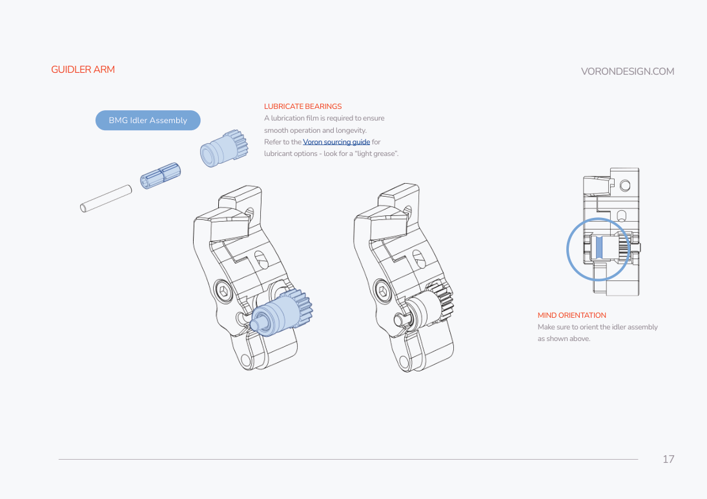
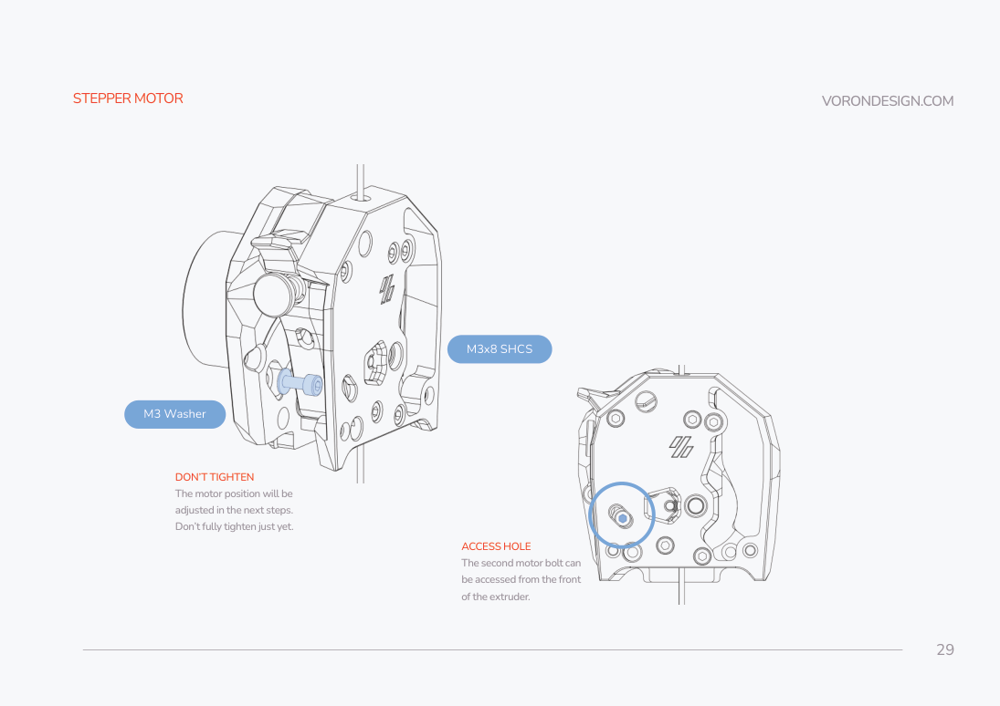
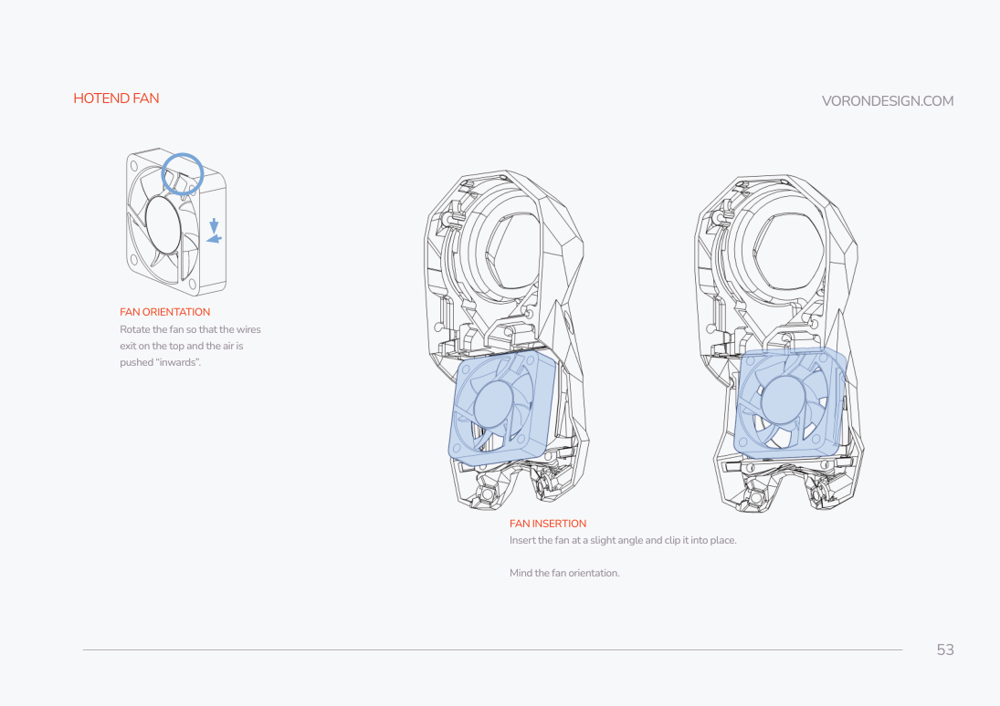
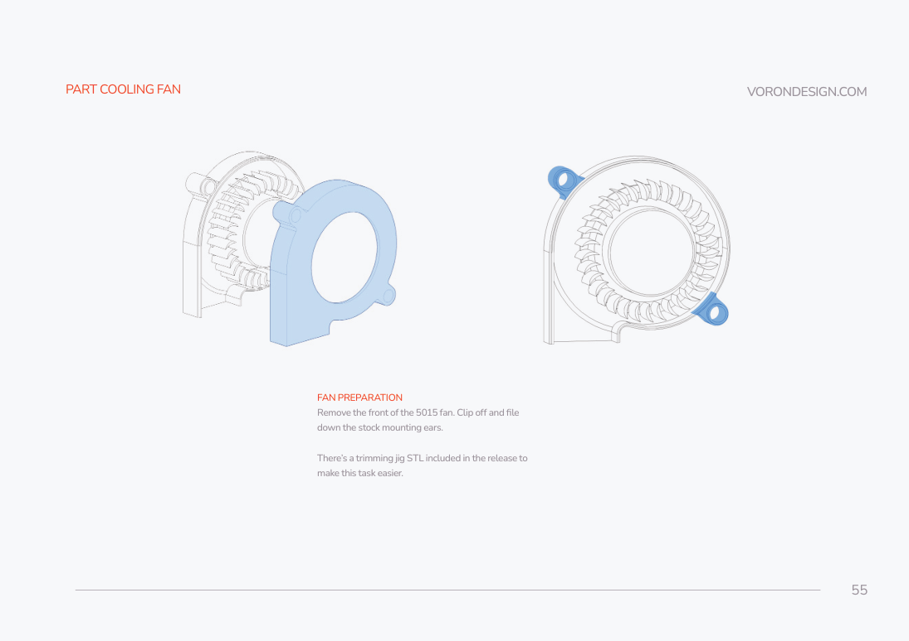
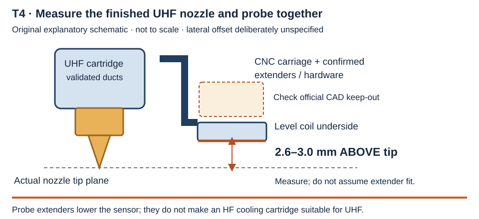

# 06 · Rapido 2 Fiber UHF, StealthBurner and Cartographer

**KEEP** the separate StealthBurner/Clockwork 2 assembly sequence when the delivered extruder hardware confirms that baseline. **REPLACE** the stock plastic X carriage with purchase **04**, the stock hotend/cartridge with purchase **03** and a validated UHF cartridge, and the stock Omron probe with purchase **05**. **OMIT** TAP, Klicky, Omron mounting and their macros from this path. **ADD** the Cartographer mounting-height, coil-clearance and cable checks below.

The V2.4R2 manual printed pp. 146–147 (PDF indices 145–146) directs toolhead assembly to the separate manual. This chapter follows [StealthBurner commit 8bcb9c246fac19d8ac03931ef97fa07c5e5f0f2b](https://github.com/VoronDesign/Voron-Stealthburner/tree/8bcb9c246fac19d8ac03931ef97fa07c5e5f0f2b), [assembly manual version 2023-07-07](https://github.com/VoronDesign/Voron-Stealthburner/blob/8bcb9c246fac19d8ac03931ef97fa07c5e5f0f2b/Manual/Assembly_Manual_SB.pdf). Its printed page equals zero-based PDF index plus one. UHF-specific interfaces are gated rather than represented as tested.

## Prerequisites, parts and tools

For the **bare-carriage procedure**, begin with the X rail and backer installed and the gantry's belt routes accessible. Perform that procedure when the gantry chapter calls for it, before the bed or complete toolhead exists. For **final toolhead/probe installation and the full travel envelope**, the gantry and identified bed geometry must be available. Power is disconnected throughout. No printed stock hotend cartridge is assembled for later replacement.

| Item | Quantity / disposition |
|---|---|
| **03** Rapido 2 Fiber / 2F, UHF/PT1000 | 1 hotend; exact hardware revision, voltage, heater rating, sensor and nozzle remain to verify |
| **04** Cartographer CNC mount | 1 carriage, 2 belt clamps/bolts, 2 M3×6 BHCS for probe listed in current package; ordered belt width and extenders unknown |
| **05** Cartographer V4 AIO Standard | 1 probe; confirm complete assembly, revision and interface |
| Clockwork 2 NEMA14 motor and BMG-type drive/idler/tension hardware | 1 set from the kit **if verified**; do not assume kit receipt established it |
| CW2 printed main body, motor plate, guidler A/B, latch, latch shuttle | 1 each; exact filenames below |
| UHF front and rear cartridge | 1 each **conditional** on T2; no HF substitute |
| StealthBurner main body, 4010 heatsink fan, 5015 blower | 1 each, voltage/version verified before connection |
| PTFE filament guide | 1 cut piece, measured against the finished CW2/cartridge |
| Nitehawk board mounts, cable door and strain relief | Actual SB or SB V2-specific parts; resolve in wiring chapter |
| UHF probe extenders and appropriate longer fasteners | Conditional requirement after measurement; not confirmed purchased |

Tools: soldering iron/heatset tip, suitable metric hex drivers, calipers, flush cutters/file for built-in supports and fan preparation, light bearing grease per Voron sourcing guidance, and a probe-height gauge. For any hotend support-screw disturbance, have the manufacturer's actual torque tool and instructions first. Hot-tightening is deferred until electrical and heater gates close.

## T1 · Confirm the extruder, carriage and endstop interfaces

> **Verification gate T1 — blocks final printed parts and rail/belt fastening.** Identify the delivered extruder motor/gears, X rail/block, CNC carriage revision and belt-width variant. Purchase 14 is documented as **6 mm XY**; the carriage must capture that same belt width. The listing supports the 6 mm carriage on MGN9 or MGN12, while its 9 mm carriage is incompatible with MGN9. Neither fact proves this delivery. Confirm the conventional Voron belt path with all Vitalii subassemblies; do not reverse it to resemble another gantry. [CNC product specifications](https://cartographer3d.com/products/cartographer3d-cnc-stealthburner-mount).

For the bare-carriage operation, close the carriage/rail/belt portion of T1 independently; extruder hardware identification is required before the later CW2 core, rather than before this rail attachment.

The [CNC installation figures](https://docs.cartographer3d.com/cartographer-cnc-mount/installation) were visually inspected. They show **four M3×8 SHCS** to the rail, **one M3×6 BHCS per belt clamp**, **two M2×10 BHCS/SHCS** for the X switch and **two M3×6 BHCS** for a standard probe without extenders. The text warns that original carriage versions instead required **M3×8 BHCS at the rail**. Match the delivered countersinks/counterbores before selecting head style or length. Do not transfer stock plastic-carriage M3×30 bolts or printed clamp screws to the CNC body.

### Bare CNC carriage and belt capture — perform during the gantry chapter

Parts for the illustrated modern revision: **1 CNC carriage, 4 M3×8 SHCS, 2 supplied belt clamps and 2 M3×6 BHCS**, the verified X rail block and the two routed 6 mm XY belts. The switch, probe, extenders and full toolhead are fitted later. Use hex drivers and calipers; no generic screw torque is specified.

1. Support the gantry and position the rail block away from the rail ends. Clean the mating faces and present the CNC carriage with its two probe legs downward and its toolhead attachment bosses facing forward, matching the official exploded rail drawing.
2. Start the **four verified rail screws** by hand. For the modern illustrated carriage these are M3×8 SHCS; use the early BHCS revision only when identified. Verify heads clear both belt paths, all screws engage the block without bottoming, and the carriage seats flush without rocking. The manufacturer suggests suitable threadlocker; keep it away from rail lubrication and use its own material/retention instructions. Retain evenly without forcing a misaligned part.
3. Route the two belts through the carriage captures as shown in the official drawing and the gantry routing procedure. Preserve their separate upper/lower planes and the normal Voron return directions. Seat each belt's toothed return fully in its matching machined capture; no tail may sit under a rail screw or foul the opposite belt.
4. Fit **one supplied CNC clamp per capture**, starting its confirmed clamp screw by hand. The modern drawing uses one M3×6 BHCS per clamp. Confirm each clamp lies flat and retains the belt without its screw bottoming. Do not substitute stock printed belt clamps or their longer screws. Leave tail length for the gantry procedure's tension/alignment checks before trimming.
5. Move the supported carriage gently by hand across the conservative accessible X range and inspect belt engagement, rail-screw head clearance, tooth alignment and both belt planes. Stop for twisting, rubbing, a slipping capture or binding. Final belt tension and complete XY-envelope checks remain in the gantry chapter.

Completion check: the bare CNC body is flush on the rail block, four correct rail screws are retained, two separate belt captures hold their tails, and manual X travel has no hardware or belt interference. Record actual carriage revision, belt width and screw head types. Later attach the physical X switch with its two confirmed M2×10 fasteners before closing wiring access.

**KEEP a physical X switch** on the carriage when its provision matches the source figure; it is separate from Z probing. Confirm Y switch and any Vitalii replacement mounting in the gantry chapter. **OMIT the stock nozzle Z-pin and Omron probe from the planned Cartographer virtual Z-homing path**; that omission becomes final only when the software generation and safe homing workflow in the software chapter are verified. It does not create permission for unconfigured homing.

## T2 · Select an actual UHF cartridge before printing it

> **Verification gate T2 — blocks hotend cartridge printing and assembly.** The pinned official Voron `phaetus_rapido_v2/README.md` explicitly describes a **High Flow** mount. Its front/rear files are not proof of UHF compatibility. The purchased Fiber UHF must retain its UHF length, nozzle and cooling arrangement.
>
> Phaetus's exact [Rapido-2F source at commit 7401934e28d56844ba4f311e9d588b1e4d0510dd](https://github.com/Phaetus/Rapido-2F/tree/7401934e28d56844ba4f311e9d588b1e4d0510dd) contains `Product Adaptor Models/voron 2.4-Rapido 2.zip`, including `voron 2.4-Rapido 2/uhf前.stl` and `voron 2.4-Rapido 2/uhf 后.stl` (front and rear). These are a manufacturer-supplied **candidate**, not a verified combined CW2/CNC/V4 installation. Confirm with the actual 2F CAD and delivered nozzle that they align the filament inlet, fan airflow, nozzle plane, CW2 attachments, SB shell and sensor keep-out. Obtain the exact supported combination or record a physical dry-fit comparison before using them. They are linked, not redistributed: the Phaetus README limits models to personal use.

A binary-STL comparison of the candidate archive finds its UHF front extends approximately **8.49 mm** farther downward than its HF front in the archive's own coordinates; its two rear meshes have the same bounding dimensions, with different hashes. This explains why a UHF-specific front is needed. It does **not** establish cooling alignment or fit with the purchased nozzle. The CNC listing's **8.5 mm probe extenders lower the probe**; they do not turn an HF duct into a UHF cooling duct.

| Exact printed path in pinned StealthBurner repo | Qty | Status |
|---|---:|---|
| `STLs/Clockwork2/Direct_Drive/main_body.stl` | 1 | KEEP if CW2 confirmed |
| `STLs/Clockwork2/Direct_Drive/motor_plate.stl` | 1 | KEEP if CW2 confirmed |
| `STLs/Clockwork2/Direct_Drive/[a]_guidler_a.stl` / `[a]_guidler_b.stl` | 1 each | KEEP if CW2 confirmed |
| `STLs/Clockwork2/Direct_Drive/[a]_latch.stl` / `[a]_latch_shuttle.stl` | 1 each | KEEP if CW2 confirmed |
| `STLs/Stealthburner/[a]_stealthburner_main_body.stl` | 1 | Conditional until the UHF cartridge/shell fan paths clear |
| `STLs/Clockwork2/cable_door_for_pcb.stl`, `[a]_pcb_spacer.stl`, `chain_anchor_2hole.stl` or `chain_anchor_3hole.stl` | Variant-dependent | Unresolved: Nitehawk revision and umbilical mounting may replace these |
| `STLs/Stealthburner/Printheads/phaetus_rapido_v2/stealthburner_printhead_rapido_v2_front.stl` and `stealthburner_printhead_rapido_v2_rear_cw2.stl` | 0 in main path | OMIT as unverified HF candidates |
| `STLs/Stealthburner/[o]_stealthburner_LED_carrier.stl`, `[c]_stealthburner_LED_diffuser.stl`, `[o]_stealthburner_LED_diffuser_mask.stl` | 1 each if installed | Optional lighting / verify kit inclusion |

Voron print guidance is ABS, 0.2 mm layers, forced 0.4 mm extrusion width, 40% infill, four walls and five top/bottom layers (SB p. 4 / PDF index 3). Use the documented settings for applicable functional parts; LEDs require the indicated opaque/translucent material. Do not label unverified LDO printed-part inclusion as owned. Archive filenames have legacy character encoding: if an extractor produces garbled names, identify the UHF members by the source archive and record the extraction mapping rather than rename an HF file.

## Assemble the confirmed Clockwork 2 core

This independent core can proceed after T1 confirms CW2 even while the UHF interface remains unresolved. Have 1 BMG-type drive assembly, 1 idler assembly, 1 spring/thumbscrew tension set, **2 MR85 bearings**, 1 NEMA14 motor and the six direct-drive printed parts.

The core drawings call for **1 M3×6 FHCS**, **4 M3×25 SHCS** (two body bolts, one guidler pivot, one latch pivot), **1 M3×16 SHCS** for the two-piece guidler, **1 M3×30 SHCS**, **2 M3×8 SHCS and 2 M3 washers** for the motor. Heatset locations are illustrated in SB pp. 11–15 (indices 10–14); count those positions against the actual matched printed parts, with additional PCB positions governed by the actual Nitehawk mount. Cable-cover/anchor hardware is separate and conditional.

1. Install heatsets in the six core parts according to those illustrations. Keep motor-plate inserts below the surface where shown on p. 12 and the guidler/shuttle inserts flush where shown on p. 15. Let each cool before fastening; verify no insert intrudes into a bearing pocket or moving joint.
2. Join guidler A/B with its M3×16 screw, fit the idler shaft/bearing/gear in the orientation shown on p. 17, and fit its spring/thumbscrew. Apply light bearing grease to the idler's working bearing surface, not the filament-gripping teeth.
3. Fit the two MR85 bearings to motor plate and main body. Bearings must slide on/off the drive shaft; fully seat their **outer rings** in the pockets without pressing through the inner ring. The p. 19–20 warning against a forced bearing fit applies here.
4. Install the M3×6 flat-head anti-squish screw as shown on p. 20. Set the drive-gear grub screw against the shaft notch; initially leave drive position adjustable. Assemble the body with its two M3×25 bolts, align the gear teeth to a sample of 1.75 mm filament, then secure the drive gear (pp. 21–24 / indices 20–23). Verify the shaft does not touch the motor housing.
5. Install the guidler and latch with the remaining two M3×25 pivots (pp. 25–27). They must move freely; tightening a pivot until it clamps the arm defeats the mechanism. Adjust anti-squish/tension only enough to allow the gears and filament path to work without binding.
6. Fit the NEMA14 motor and the p. 28 M3×30 screw. Start the two M3×8 motor screws/washers loose; adjust mesh through the access hole, leaving faint gear play and full tooth overlap; then retain the motor (pp. 28–30 / indices 27–29).

These retained CW2 diagrams apply only after CW2 identification. They do not depict or verify the custom UHF hotend, CNC carriage or V4 probe. © Voron Design, GPL-3.0; [pinned manual](https://github.com/VoronDesign/Voron-Stealthburner/blob/8bcb9c246fac19d8ac03931ef97fa07c5e5f0f2b/Manual/Assembly_Manual_SB.pdf).

Completion check: latch opens and closes, idler pivots freely, shaft has clearance, gears turn smoothly, and a sample filament follows the centered path. Do not connect the motor yet.

## T3 · Install the exact 2F UHF hotend and cooling cartridge

> **Verification gate T3 — blocks support-screw changes and hotend/cartridge installation.** Read the delivered 2F label and instruction sheet: revision, voltage, heater power/current, PT1000, nozzle type/diameter and installed UHF adapter. The [manual shipped in Phaetus's pinned Rapido-2F repo](https://github.com/Phaetus/Rapido-2F/blob/7401934e28d56844ba4f311e9d588b1e4d0510dd/Instructions%20Sheet/Rapido%20Hotend%202%20Instruction%20Sheet.pdf) is titled “Rapido Hotend 2,” ©2023 and covers several assemblies. It does not verify this unit's electrical ratings. Its internal support-screw specifications cannot be copied blindly to a revised 2F.

Do not loosen the thin heatbreak/support screws merely to fit a guessed cartridge. The Phaetus manual warns against bending the thin heatbreak and calls for even tightening with a low torque tool when its matching titanium-screw version is assembled (printed p. 07 / PDF index 7). The hot nozzle burns; hot-tightening is essential to prevent leaks for the documented nozzle design but belongs **after controlled heater commissioning**, not this cold assembly stage.

1. After T2/T3 close, remove only the top groove-mount adapter/collet where the confirmed cartridge requires four heatsink attachment screws. The Voron HF README describes two M2.5×5 adapter screws and four M2.5×8 heatsink screws; use that hardware only when the exact UHF mounting design and delivered heatsink confirm it.
2. Dry-fit the exact UHF front and rear around the heatsink. Confirm the hotend's fastener heads, heater/sensor exits and support screws clear every boss. The official Rapido V2 reference figures place heater wires **below** the mounting boss and sensor wires **above** it. Apply that routing only if the exact 2F geometry agrees; do not strain its heater tab or sensor to mimic another revision. [Pinned orientation figures](https://github.com/VoronDesign/Voron-Stealthburner/tree/8bcb9c246fac19d8ac03931ef97fa07c5e5f0f2b/STLs/Stealthburner/Printheads/phaetus_rapido_v2/Rapido_V2_Assembly_Images).
3. Fasten the validated front/rear and heatsink using that cartridge's documented screws/inserts. The HF reference uses two M3×12 join screws and four M2.5×8 heatsink screws; these remain a comparison, not an automatically approved UHF stack. Verify straight cold filament passage; do not use a screw to force the heatbreak into alignment.
4. Cut/seat PTFE only after the UHF cartridge and CW2 are dry-assembled. SB p. 43 (index 42) uses **11 mm above the cartridge top** for its CW2 baseline. Verify the actual path joins without a gap or compressed/bowed tube before final cutting; do not carry over a Revo cartridge's total tube length.
5. Install the silicone sock matching the actual UHF block/nozzle. Fit the fan shell only after confirming the longer cartridge's outlets aim around the nozzle without touching the sock/block or obstructing heatsink airflow.

Completion check: the hotend is rigid without heatbreak stress, fan airflow reaches the heatsink, part ducts and socket clear the UHF block, filament passage is straight, and actual nozzle geometry is recorded. Leave electrical load confirmation to the wiring chapter.

## Assemble fans, lighting and attach the toolhead

With a validated UHF shell/cartridge, follow the illustrated SB pp. 45–56 (indices 44–55): remove the built-in supports; add the optional lighting carrier/diffuser/mask before fans; route the lighting to the right side; clip the heatsink fan with wires at the top and airflow **inward**; then fit the blower. Confirm fan voltage before wiring. Trim the 5015 front/ears only if this delivered fan matches the documented design; the optional `STLs/Tools/SB_5015_Cutting_Tool_A.stl` and `_B.stl` are one each. The source drawing uses one M3×6 FHCS for the blower.

These fan diagrams show the standard SB reference assembly. Validate the UHF cartridge and exact fan first; the drawings establish fan preparation and orientation, not UHF duct clearance. © Voron Design, GPL-3.0; [pinned manual](https://github.com/VoronDesign/Voron-Stealthburner/blob/8bcb9c246fac19d8ac03931ef97fa07c5e5f0f2b/Manual/Assembly_Manual_SB.pdf).

After T1 and T3 close, retain CW2 to the confirmed CNC mount/cartridge interface. SB pp. 64–67 use two M3×8 for CW2, then two M3×25 and two M3×50 for the standard shell. These are **standard reference fasteners**: validate their engagement, shoulder clearance and bottoming in this CNC/UHF stack before use. Do not press a printed shell into position with a longer screw. Fit the correct Nitehawk board mount/door and cable strain relief from the wiring chapter before closing access.

## T4 · Mount and measure Cartographer V4

> **Verification gate T4 — blocks final probe fastening and probing.** Confirm this is the **V4 AIO Standard**, the carriage version, extender inclusion, screw engagement and coil keep-out. The carriage is sold as 6 mm, 6 mm with **8.5 mm UHF extenders**, or 9 mm with extenders; the purchased variant is unknown. The example installation figures show a standard probe, so the actual V4 CAD and dimensions must match before use. Recheck B1: embedded bed magnets remain incompatible with scan meshing.

1. Mount the probe coil flat beneath the CNC carriage in the demonstrated orientation, using its two confirmed M3 holes. Standard illustrations specify two M3×6 BHCS without extenders; extender assemblies need their own confirmed longer screws. Check the mounting parts bear on the intended surfaces without bending the PCB.
2. If the longer UHF nozzle leaves the coil too high, fit **confirmed** UHF extenders and hardware; measure again. Do not stack arbitrary washers or assume 8.5 mm extenders automatically produce the correct final height.
3. Measure the coil underside relative to the **actual installed nozzle tip**. Current manufacturer hardware setup specifies **2.6–3.0 mm above the nozzle tip plane**, with the probe level. Use a gauge, then record measured X/Y offsets rather than the listing's nominal coordinates.
4. Check the manufacturer's CAD keep-out above the coil against carriage, extenders, fastener heads and wires. Keep unintended metal out of that region. Sweep the toolhead manually across the conservative accessible envelope; the coil must never touch plate clips, side mounts, frame, brush or hotend wiring.
5. Route the probe cable along the supported umbilical/Bowden route with strain relief, free bend clearance and no snag. Manufacturer warning: the supplied USB cable is **not rated for cable chains**. Select USB/CAN only in the wiring chapter after exact pins/power are verified; an original Nitehawk SB is not a CAN host. [Cartographer hardware setup](https://docs.cartographer3d.com/cartographer-probe/installation-and-setup/probe-installation).

Nozzle cleaning must avoid sweeping the Cartographer coil over a metal brush. Use a documented silicone cleaning arrangement or manual cleaning during initial calibration; ownership/location of a silicone brush is unverified, so no automatic brush macro is enabled. Clean the nozzle before any later Touch workflow. The firmware generation, safe Z homing, QGL, scanning mesh and measured boundaries are established in the software chapter; do not use the older FAQ macros as configuration authority.

Completion check: purchases 03/04/05 each have an identified variant and planned disposition; the probe is retained and level at the measured height, no metal violates keep-out, all belt clamps and switch mounts clear travel, and cable relief has full bend clearance. The bed/nozzle envelope is recorded with the finished UHF toolhead. Any open T1–T4 gate remains a block on its affected operation. Continue to the wiring chapter without powering the toolhead.
