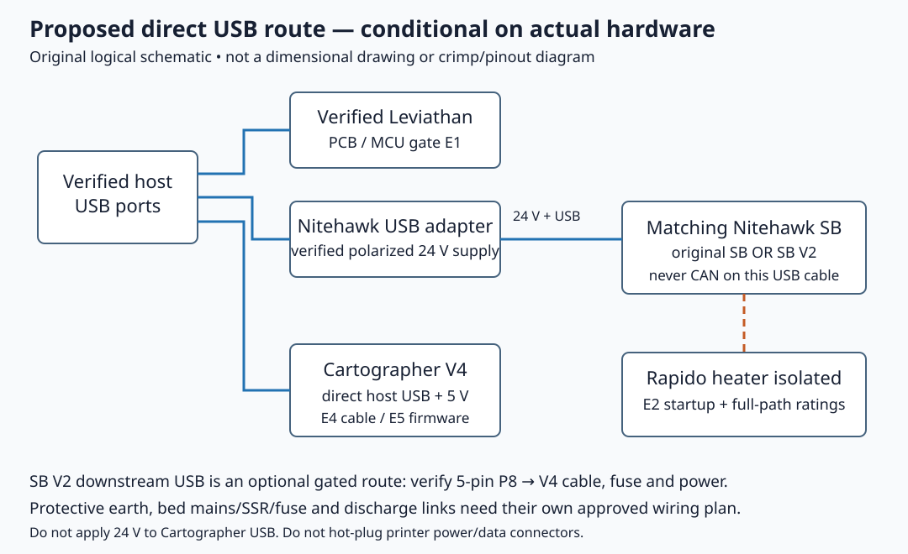

# 07 — Wiring the modified printer

**Readiness: conditional instructions; heater circuits remain blocked.** Complete independent cable preparation while the gates below are open. No pinout in this chapter establishes what was shipped in purchase **01**.

**Prerequisites:** frame and gantry assembled and manually checked; modified bed and toolhead fitted; electronics compartment accessible; purchase **03** heater and PT1000 leads individually identified; purchase **05** probe identified as V4 Standard. **Parts:** one actual mainboard; one actual toolboard, its matching fan adapter and USB/power adapter; one host; six motion motors and one extruder motor; one PSU arrangement; one bed heater/sensor/fuse/earth harness; one toolhead cable; one probe cable. These kit component quantities describe the intended architecture, not verified box contents. Terminal, fuse, cable, bed-heater and adapter ownership is unconfirmed. **Tools:** multimeter, ferrule crimper, wire stripper, connector crimper appropriate to the actual contacts, PH2 driver and hex drivers. LDO specifies E0508 heater ferrules; verify conductor fit before selecting them.

**KEEP:** protective earth, separation of mains and low-voltage wiring, securely mounted electronics, individual motor labeling and strain relief. **REPLACE:** stock Octopus/toolhead/probe wiring with the verified board route below. **OMIT:** stock Omron probe, Klicky/TAP additions and stock nozzle Z-switch wiring in the selected Cartographer path. Keep omitted parts as surplus; do not install then remove them. **ADD:** Cartographer USB wiring and the measured PT1000 circuit.

Base manual references are printed pp. 180–209 (zero-based PDF indices 179–208), a **stock reference**, not the pinout for this modified printer. The [LDO Rev D wiring guide](https://docs.ldomotors.com/en/voron/voron2/wiring_guide_rev_d) supersedes stock kit wiring only when the box and cables match it. Its toolboard discussion still links the original Nitehawk SB; the [SB V2 guide](https://docs.ldomotors.com/en/Toolboard/nitehawk-sb-v2) governs a confirmed V2 board.

## E1 — Identify boards and the power architecture before connecting cables

Record PCB silkscreen revision, MCU marking, matching fan adapter revision, PSU model/rated outputs, supply-voltage selectors, fuse markings and cable labels in the build manifest. Photograph each connector with its latch/key visible, without private order material. Resolve kit revision independently from Voron design revision.

| Confirmed hardware only | Firmware distinction | Wiring evidence |
|---|---|---|
| Leviathan V1.3 | STM32H743, 25 MHz; manufacturer USB example uses 128 KiB Katapult | Pinned V1.3 manual printed pp. 5–9, indices 4–8 |
| Earlier Leviathan | Do not apply V1.3 target or assume F446 until PCB is identified | Obtain exact-revision manual and schematic |
| Nitehawk SB V2.0.0 | STM32G0B1, 12 MHz, 8 KiB Katapult; USB PA11/PA12 | Pinned V2.0.0 schematic and V2 connector diagram |
| Original Nitehawk SB | RP2040, separate firmware/configuration; manufacturer Katapult instruction uses 16 KiB | Original SB documentation and pinned original configuration |

The generic `voron2_leviathan.cfg` header and the Rev D webpage describe an F446, while the V1.3 manual describes H743. This is a documented source disagreement; **do not flash from that generic header**. Original SB and SB V2 fan adapter headers also differ. The V2 manufacturer FAQ says the old fan adapter cannot be reused.

1. Mount electronics on their verified brackets; confirm no conductive PCB underside contacts a DIN rail or fastener. Prepare PSU input selection using its label/manual. The LDO note about 115/230 V selectors does not apply to its universal-input alternative.
2. Label six motion-motor harnesses at both ends: A, B, front-left Z, rear-left Z, rear-right Z and front-right Z. Retain actual connector numbering in a separate record. Verify paired windings and the manufacturer's motor connector order with the power disconnected.
3. Dry-route mains, bed-temperature, motor, host and toolhead harnesses with ducts open. Ensure screw terminals and connectors remain accessible. Check that the MRW support freedom is not restrained by a tight cable.

**Completion check:** every board, fuse, PSU input and output, connector, motor and cable has a known identity. Unknown revision blocks board-dependent connections and firmware selection, while cable labeling and independent mechanical work can proceed.

## E2 — Resolve the Rapido electrical load before connecting HE0

Purchase **03** is reported as **Rapido 2 Fiber UHF/PT1000**, not an established heater rating. Obtain its exact revision/label, voltage, rated operating load, cold resistance/startup or peak-current information and heater lead specification from Phaetus or the actual package. The linked Phaetus Rapido-2F manual is titled Rapido Hotend2; it does not establish the exact purchased Fiber heater's startup load. Do not substitute Rapido HF, Plus or X specifications.

The [Nitehawk SB V2 electrical table](https://docs.ldomotors.com/en/Toolboard/nitehawk-sb-v2#electrical-specifications) specifies **4.5 A maximum continuous hotend current**, limited by the MOSFET. At 24 V this is 108 W electrically; that arithmetic is not a Rapido rating or permission to run a 108 W heater. Startup current, pulsed MOSFET capability, terminal/umbilical contacts, cable gauge/temperature, branch fuse and shared PSU headroom all require verification. The pinned V2 schematic labels the heater MOSFET AON7524; its part name alone does not rate the assembled board for a larger heater.

| Circuit | Confirmed manufacturer fact | Required decision |
|---|---|---|
| V2.0.0 HE0 → Rapido | HE0 control PA7; 4.5 A continuous board limit | Exact heater startup and operating current must fit the entire path |
| V1.3 mainboard heater output | V1.3 manual: 180 W/7.5 A maximum | Not a preapproved alternate route; additional cable/fuse/PSU evidence and wiring review required |
| Original SB HE0 | Different RP2040 pin mapping; separate documentation | Reassess ratings for actual revision; V2 pins do not apply |
| Bed-heater signal output | Controls a rated SSR only for an AC heater design | Never put mains on a DC heater terminal or probe connector |

**Unresolved is a hard heater block.** Leave the Rapido heater unplugged and insulated. Do not bypass a fuse or enlarge it to obtain a first heat-up. A software `max_power` setting limits average duty cycle and cannot establish safe instantaneous current. The [historical LDO Rapido erratum](https://docs.ldomotors.com/en/voron/voron2/kit-errata#rapido-hotend-considerations) concerns swapping **Octopus** outputs; neither its wiring swap nor its PA1/PA2 assignments applies to this build.

Once E2 is signed off with ratings and exact PCB revision:

1. Prepare the heater ends using correctly sized ferrules and the board's documented terminal procedure; never clamp solder-tinned strands under a screw terminal. Do not invent terminal torque. The resistive heater itself is nonpolarized, but the PSU/adapter path is polarized.
2. Connect the PT1000 to confirmed TH0, separate from heater leads. For **V2.0.0 only**, TH0 is a 2-pin JST-PH connector, ADC **PB12**, documented pull-up **2200 Ω**. It is a resistance sensor circuit, not a supply output. Use Klipper `sensor_type: PT1000`; do not retain a stock thermistor model.
3. Connect extruder motor and fans to the matching toolboard/fan adapter. V2 fan voltage selection is modified by PCB traces/pads, rather than a universal jumper. Check the actual fan ratings; do not perform that PCB modification unless the exact manufacturer's procedure is required for the purchased fans.
4. Install the toolboard-to-extruder-body and USB-adapter-to-earthed-frame grounding links described by LDO for the actual board revision. These static-discharge links do not replace protective earth to bed/frame/PSU.

**Completion check:** the heater-path record includes all current limits, cable/connector/fuse identity and startup evidence; PT1000 is individually labeled and cannot be confused with CT or HE0; connector covers close without pulling conductors.

## E3 — Verify the modified bed circuit before mains work

The stock LDO bed's prebonded heater, magnet layer, thermal sensor and fastening pattern do not establish the MRW bed's installed components. Purchase **06** heater options remain unknown. Do not detach and reuse a bonded stock heater or magnetic layer on the UltraFlat plate without explicit manufacturer instructions.

LDO's manufacturer warning requires mains work by certified personnel trained in local regulations and safety standards. Keep the inlet unplugged during assembly. Software and a multimeter continuity check do not certify electrical safety.

1. Confirm heater voltage/power/physical size, bonded mounting procedure, sensor model, leads, thermal fuse temperature/current/attachment method, SSR make/rating/derating/heatsink and inlet/branch fuses for the actual bed system. If any is missing, classify it as **required but not confirmed owned** and keep bed wiring and heating blocked.
2. Have the qualified installer wire inlet, isolating switch, PSU, SSR and bed using the actual circuit and local requirements. Keep mains terminals covered; retain a separately identifiable protective-earth conductor. Follow terminal ratings and manufacturer's tightening instructions. The Leviathan's DC bed-output rating is not a mains rating.
3. Connect a protective-earth lug directly to the MRW plate at its approved location with hardware providing reliable metal contact, strain relief and slack for thermal expansion. Do not rely on anodized Wings, kinematic points, magnets or a linear rail as the earth path. Ground PSU enclosure and conductive frame as specified by the qualified installer.
4. Fit an independently acting thermal fuse in the heater power path according to heater/bed instructions. Verify its attachment and wiring; Klipper heater verification is an additional software safeguard, not a substitute.
5. Route bed leads so that gantry/belts, kinematic motion and Z travel cannot rub or pinch them. Keep thermistor leads away from mains terminals. A stock Rev D bed-WAGO/thermistor splice arrangement is reusable only after connector ratings, approved wire sizes and MRW geometry have been verified.

**Completion check:** the bed circuit has a documented approved diagram, fuse and sensor identity, protective-earth connection and full travel strain-relief inspection. Bed power remains disconnected until the pre-power checklist passes.

## E4 — Choose the Cartographer interface and cable before connection

**Proposed primary route: direct host USB to Cartographer V4 Standard**, with its documented **5 V USB power**, after the actual USB firmware and cable have been identified. Retain the Nitehawk's independent host USB path. This avoids an unverified custom downstream adapter; it does not prove cable ownership or cable-chain suitability.

The figure shows logical connections only. The Nitehawk XT30(2+2) combined power/data cable carries **24 V and USB**, not CAN. Its ordinary three-pin PROBE port supplies 24 V and must not be used as Cartographer USB power.

The V2's downstream USB route is **conditionally compatible**, not automatically wired:

| Logical signal | Nitehawk V2.0.0 P8, schematic numbered pins | Cartographer Standard USB documented signal order |
|---|---|---|
| 5 V VBUS | Pin 1, via F1 `BSMD0603-075-6V` | Ground, Data+, Data−, 5 V in the manufacturer's illustrated view |
| Data− | Pin 2 | Match Data− by continuity and illustrated view |
| Data+ | Pin 3 | Match Data+ by continuity and illustrated view |
| Ground | Pins 4 and 5 | Match ground; fifth Nitehawk contact needs a documented harness treatment |

**This table is a net list, not a left-to-right crimp recipe.** The inspected V2 photograph reads GND, GND, D+, D−, 5 V from its illustrated side, whereas schematic numbering starts at VBUS. Plug-side views can reverse order. LDO calls P8 JST-ZH1.5 5P; Cartographer V4 Standard is advertised with a four-pin Molex Sherlock connector. The generic Cartographer Standard wiring figure is an older-format reference; match the actual V4 connector documentation rather than transferring its pictured contact positions. Verify exact connector/contact part numbers, probe pinout orientation, supplied cable and the downstream port's usable current/fuse behavior before fabricating or buying that harness. Do not assume the 5 V converter's total rating is the USB port rating. No such downstream port is established for original SB.

1. For the primary direct USB route, check the keyed probe connector against [Cartographer wiring diagrams](https://docs.cartographer3d.com/cartographer-probe/installation-and-setup/probe-installation/wiring-diagrams). Never apply the toolboard's 24 V to USB VBUS.
2. Keep the supplied Cartographer USB cable out of a drag chain unless its exact variant is documented as chain rated. Cartographer warns that its supplied cable is not chain rated. Route an approved umbilical beside the Bowden path with end strain relief and clearance throughout travel; provide a verified chain-rated replacement only if required by the actual route.
3. The Nitehawk toolhead cable has a documented nominal 28 mm bend radius; retain at least that radius without tight bends at the connector. Tie down both ends and retain enough slack. Do not transfer this rating to the Cartographer cable.
4. With power disconnected, verify each cable's end-to-end mapping, no shorts, keyed mating orientation and ground/shield treatment. Check cable sweep by manually moving supported mechanics through the measured envelope.
5. Mate power/data connectors only with the printer powered off. LDO specifically prohibits hot-plugging the Micro-Fit end; Cartographer likewise prohibits powered connector changes.

**CAN is a conditional alternate only if actual hardware requires it.** Identify a supported CAN interface, V4 CAN firmware/bitrate, bus ends, termination state, actual CAN-port supply voltage and V4 CAN power input specification. The Leviathan V1.3 CAN connector diagram shows **24 V**, so USB's 5 V pinout cannot be copied to it. Do not connect to the Nitehawk USB connector as CAN. Follow the V4 switching and termination instructions after those facts are settled; neither CAN hardware nor cable is confirmed owned. Record the chosen route; do not enable both serial and CAN UUID in one MCU section.

**Completion check:** the chosen interface, firmware, cable identity, pin-to-pin mapping, supply voltage, rating and full travel routing have been recorded. Keep unknown cables disconnected. Continue to [software preparation](08-software.md) without energizing heaters.

## Source and figure notes

Manufacturer connector diagrams and schematics were downloaded and visually inspected, including V2 downstream USB F1/P8 and Leviathan V1.3 pin assignment/USB firmware target. Third-party images/PDFs are linked rather than redistributed because their independent reuse terms are not established. The local SVG is an original logical schematic, not an assembly drawing. Exact revisions, hashes and retrieval dates are recorded in [electronics research](../data/electronics-research.json).
