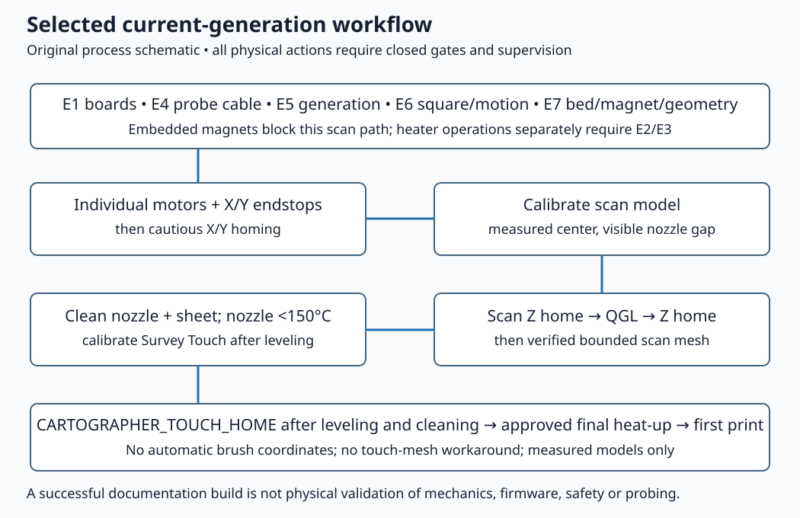

# 08 — Software preparation and the probing workflow

**Prerequisites:** E1 PCB identification, E4 interface/cable verification and an approved unheated initial configuration; E2/E3 are still required before heaters are enabled. **Parts:** one identified host, one identified mainboard, one identified toolboard and purchase **05** Cartographer V4 Standard. **Tools:** host terminal, version-control tools, editor and Klipper/Moonraker interface. Record versions locally; never publish credentials or private host addresses.

**KEEP:** CoreXY kinematics, four independently mapped Z motors, physical X/Y endstops where their replacement mounts are proven, and Klipper heater verification. **REPLACE:** stock Z endstop with the Cartographer virtual endstop after E5/E7. **OMIT:** Omron, Klicky, TAP and nozzle-switch macros/configuration in this selected path. **ADD:** matching Cartographer driver and separate measured probe/motion configuration.

## E5 — Select one board/driver/firmware generation

The [commented examples](../config/cartographer-v4-survey-usb.cfg.example) are review worksheets, not a `printer.cfg`. Every line is commented, required measurements are explicit placeholders, and none includes a motor movement or heater macro that can run. Do not rename an example and treat it as deployable.

| Component | Proposed documentation baseline | Evidence boundary |
|---|---|---|
| Klipper host and main/toolboard firmware | `Klipper3d/klipper` source snapshot `461c4e3722c3a897fba1c6b3f0780a5315043842` | Host/MCU builds must match; installed version unknown |
| Leviathan V1.3 only | H743, 25 MHz, USB; manufacturer Katapult target 128 KiB | Factory firmware/bootloader unverified; generic F446 header conflicts |
| Nitehawk SB V2.0.0 only | G0B1, 12 MHz, 8 KiB Katapult, USB PA11/PA12 | Separate from original SB firmware and pins |
| Original SB only | RP2040, USB, manufacturer's 16 KiB Katapult offset | Conditional original-board worksheet only; not active beside V2 |
| Cartographer V4 Survey candidate | V4 **6.1.0 USB Full**, 8 KiB-offset binary in firmware source `e5c2b17dbe04ec1f747af5d81b2215949a0a9f8e` | Actual installed firmware/host performance unknown |
| New Cartographer host driver | `cartographer3d-plugin` snapshot `06e016905cc3d209ceb543afd59a580bcabc44be` | Current-generation documentation family; exact candidate combination not tested on this printer |

This is a pinned research baseline, not an assertion that those snapshots have been jointly hardware-tested. Confirm a released compatible plugin/firmware pair for the actual hardware with the vendor before probing; record the selected plugin version/commit and firmware filename/hash in the machine manifest. Review release changes before updating. The locked V4 USB firmware binary's SHA-256 is in the research file; it was hashed, **not flashed**.

The current [Cartographer Klipper setup](https://docs.cartographer3d.com/cartographer-probe/installation-and-setup/software-configuration/klipper-setup) uses the new plugin and `[cartographer]`. The **original-plugin** archive uses a different `[scanner]` workflow; still older classic pages can use `[cartographer]` with different behavior. A section name alone does not prove generation compatibility. Remove legacy includes, old scanner/cartographer calibration blocks in `SAVE_CONFIG`, and duplicate updater sections before choosing the new Survey workflow. Preserve a private backup first. Avoid copying archived `CARTOGRAPHER_CALIBRATE`/`CARTO_TOUCH` macros into the new configuration.

1. Prepare the host using [Voron software setup](https://docs.vorondesign.com/build/software/) and the actual host/OS instructions. Inspect the kit's existing configuration first if it later becomes available. Save an inventory of active includes, devices and versions before changing it.
2. Compare the exact board target and bootloader to the manufacturer's diagrams. If an update is required, follow the identified board's manufacturer procedure. **No flashing is part of documentation validation.** A V1.3 H743 must not receive F446 firmware; an original SB must not receive V2 G0B1 firmware.
3. Use [Leviathan worksheet](../config/leviathan-v1.3-usb.cfg.example) plus exactly one of [V2 toolboard worksheet](../config/nitehawk-sb-v2-pt1000.cfg.example) or [original SB worksheet](../config/nitehawk-sb-original-pt1000.cfg.example), only after the matching PCB is confirmed. Record actual USB device paths after supervised first-start; never invent them.
4. Install the matching vendor driver using its reviewed installation procedure at the chosen version. The vendor's installer resolves a released package; a pinned documentation checkout alone does not pin the installed Python package. Record that package version, dependencies and source commit after installation. Do not run arbitrary moving-branch shell pipelines as a substitute for review.
5. Audit the final merged configuration: only one `[mcu nhk]`, one `[extruder]` heater/sensor definition, one authoritative endstop per axis, one `[cartographer]`, one Z virtual-endstop definition and no active stock probe macro. LDO's partial toolboard configuration assumes it overrides mainboard extruder/endstop fields; manually verify the merged values rather than relying on include order to conceal contradictory settings.
6. Keep device IDs, sensor limits, run currents, motor direction, offsets, travel boundaries, QGL positions, mesh bounds, rotation distance, PID constants and tuning results unset until confirmed or measured. Retain Klipper's `[verify_heater]` behavior; do not weaken it to hide heater faults.

**Completion check:** the source-lock record and installed versions agree; each MCU path maps to the physically identified board; firmware family, bootloader and interface match; a reviewed configuration exists with heaters disabled/disconnected until E2/E3 and the first-start checklist permit them.

## E7 — Probing geometry and bed compatibility before Z homing

Purchase **06** magnetic variant remains unknown. Cartographer's [official FAQ](https://docs.cartographer3d.com/cartographer-probe/faq) identifies embedded-magnet beds as incompatible with normal scanning. A uniform magnetic sheet is a different arrangement. **An embedded-magnet UltraFlat variant blocks this guide's scan Z-home, QGL and mesh path.** Do not assume nozzle touch eliminates electromagnetic effects or use touch mesh as a workaround; current [Touch documentation](https://docs.cartographer3d.com/cartographer-probe/features/touch) explicitly marks touch mesh unimplemented. Preserve the purchased bed and register the unresolved interaction rather than silently replacing it.

Before any Cartographer motion, establish the bed's magnet arrangement and installed spring-steel sheet, probe height/keepout from chapter 06, measured nozzle-to-coil X/Y offsets, nozzle and coil reachable rectangles, safe Z clearance and the physical center reference point. Never set 175,175 merely because the provisional plate is 350 class. A point is valid only if **both nozzle and coil** remain over the usable surface as required by the procedure.

Configure Z with `probe:z_virtual_endstop`, `homing_retract_dist: 0`, and a verified central safe-home position after E5/E7. Establish QGL gantry coordinates and probing points from the actual four Z support locations and measured usable surface; do not reuse a vendor's stock 350 coordinates blindly. Mesh limits refer to probe coordinates, so apply measured offsets and travel limits consistently. See [Klipper configuration reference](https://www.klipper3d.org/Config_Reference.html#quad_gantry_level).

## Selected workflow after commissioning gates pass

The selected current-generation workflow separates scanning from nozzle touch. Ordinary Z homing, QGL and bed mesh use the calibrated scan model. Survey Touch establishes nozzle contact **after** leveling, with a clean nozzle below 150 °C. Keep the bed mechanically seated and the same sheet fitted through calibration and printing. The commands below are instructions for a future supervised physical procedure, not actions run during this project.

1. After the individual motor/endstop/travel checks in [commissioning](09-commissioning.md), home X and Y separately and verify their direction and stop behavior. Run the vendor's **new plugin** scan-calibration sequence at the measured zero-reference point: `CARTOGRAPHER_SCAN_CALIBRATE`, carefully approach using the specified feeler-gauge procedure, and save the measured model. The manufacturer's procedure targets 0.1 mm and warns to retain a visible gap; do not automatically lower from an unknown Z position.
2. Verify scan Z homing with immediate-stop access, then run QGL at conservative verified clearance and points. The four rigid Z joints must already be squared and free from binding. Recheck scan Z homing after QGL; do not command repeated leveling to force a mechanically skewed gantry.
3. Remove filament residue from the nozzle and debris from the sheet manually while stationary. Use the hotend maker's temperature and handling instructions only after E2 is closed; cool the nozzle below **150 °C** before Survey Touch. No automatic brush/purge bucket is confirmed purchased, so no cleaning coordinates or brushing macro is enabled.
4. Calibrate Survey Touch using `CARTOGRAPHER_TOUCH_CALIBRATE` only with rigid toolhead/bed/gantry and a clean nozzle/sheet. Observe contact and keep immediate-stop access. Save the measured touch model. If contact does not occur where expected, stop and investigate mechanical noise/rigidity rather than blindly increasing thresholds.
5. For a normal start after all calibrations: fit the recorded sheet, clean nozzle, bring bed to the validated condition and nozzle to a verified non-oozing temperature below 150 °C; scan-home; QGL; scan-home Z again; generate the bounded scan mesh; perform `CARTOGRAPHER_TOUCH_HOME` after leveling and just before final print heat-up; heat to the approved print temperatures; begin a supervised first layer. If the exact selected release changes required order, update this workflow and its lock together before use.

**Completion check:** scan and touch models are measured for the actual geometry/firmware and no contradictory Omron/Klicky/TAP/nozzle-switch configuration remains. Record new offsets or sheet changes as calibration changes, not as fixed values in this public guide. Proceed to [commissioning and first print](09-commissioning.md).
