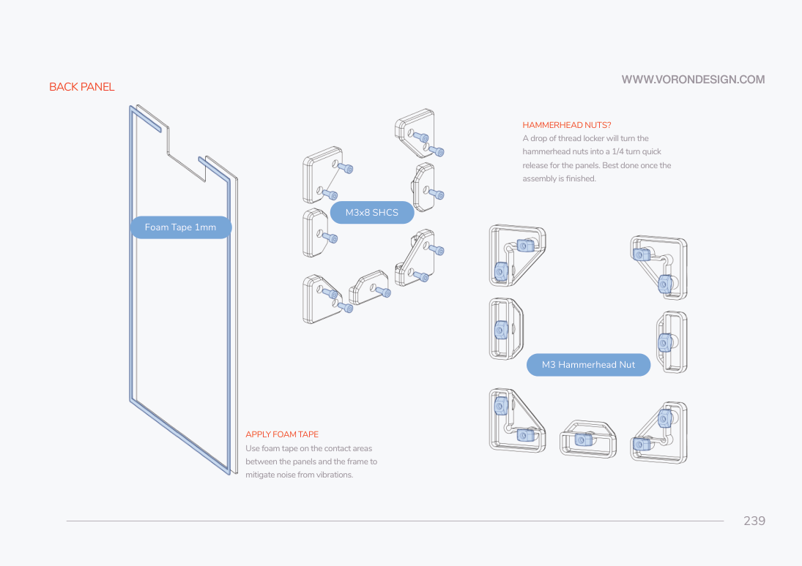
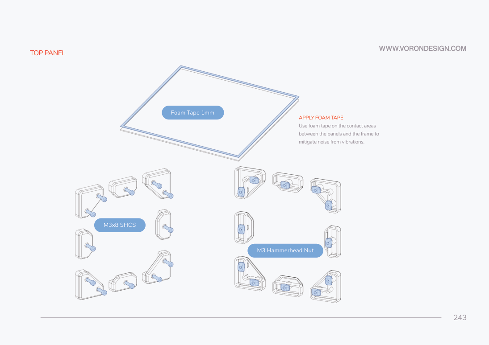
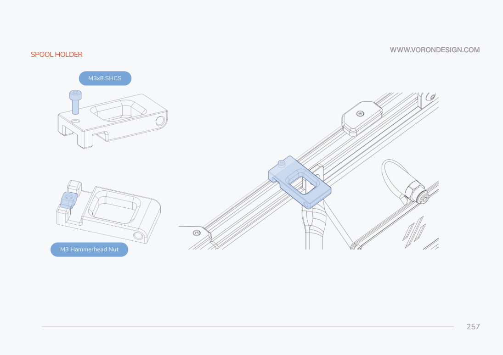
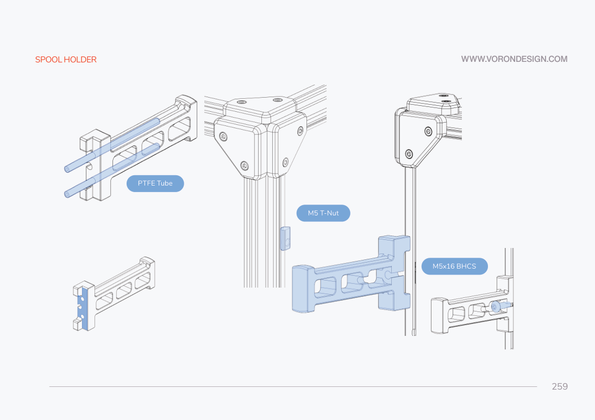

# 10. Enclosure, filament path and first print

**Prerequisites:** mechanical travel checks complete; all electrical, probing,
heater and calibration gates in chapters 7–9 closed for the operations below.
Never treat completion of this chapter as a waiver for an open gate.
**Tools:** hex drivers, scissors, ruler, calipers and appropriate adhesive.
**Parts:** one each back/top/bottom panel, two side panels and two doors; retained
350 skirts (front A/B one each, side A/B two each, rear centre one), panel clips
selected by actual thickness, six stock hinges, two each handle A/handle B/latch,
1 mm foam and VHB tape, two 60×20 bay fans if confirmed in the kit, four belt
covers, one spool holder, one Bowden retainer, PTFE tube, screws/nuts in the
specific retained figures. LDO-provided options still require a carton audit.

## Enclose only after cable and motion checks

**KEEP** retained skirts and panel mounting pp211–213,217–219,222–249.
**REPLACE** display/inlet instructions with the actual LDO electronics branch.
**OMIT** stock mini12864/EXP cabling when the verified kit uses the LDO DSI
touchscreen; do not build both display systems.

### P2 — panel, inlet and display fit before closing the electronics bay

Measure the actual deck/bottom/side/top thickness and inlet body. Confirm skirt
size, bay-fan voltage, touchscreen type and mount before installing. The provisional
LDO BOM and supplement disagree on deck thickness, and the display may be a
purchased kit option. Select the matching parts instead of adapting by force.

1. Clear built-in skirt supports and install the pictured inserts, pp211–213.
   Fit the two bay fans in the retained side supports with airflow arranged to
   ventilate the electronics bay. Fit the retained front and side skirt pieces
   with the M3x8/appropriate M3 nuts in pp217–230. The drawings distinguish the
   frame nuts from print inserts; do not screw into an extrusion slot without
   its nut. Preserve service access to the inlet and fuse.
2. Fit the LDO combined inlet skirt only after its dimension/clearance check
   in wiring. Fit the confirmed touchscreen mount, or leave that display area
   safely blank until the kit option is identified. Close all unused openings
   exposing mains; do not operate with a reachable uninsulated terminal.
3. Apply VHB to the bottom-panel clips/hinges, p232, then use M3x8 SHCS in the
   retained bottom-panel fittings, p233. Ensure opening the panel does not
   pull a PE conductor, strain a connector, or contact a live terminal.
4. Fit the four belt covers with the confirmed M3 hardware, pp234–236. If LED
   wires use the Z-motor opening, the LDO `z_belt_cover_a_led.stl` is a conditional
   alternative. Keep wires clear of moving belts. The CNC upper tensioners need
   access from above; do not permanently block their adjustment.

5. Apply 1 mm foam at back/side/top panel-frame contact areas, pp239–244. Use
   the matching corner/midspan clips with M3x8 SHCS and M3 hammerhead nuts,
   as the figures show. Confirm each nut has rotated into capture. Check that
   panel edges do not touch backers, rear belts or electronics wiring.
6. Prepare the two sets of stock door handles/latches with their magnets,
   p245. Test magnet polarity **before** gluing. Fit three hinges per door and
   the shown M3x8/hammerhead/VHB interfaces, pp247–249. If the actual kit supplied
   LDO alternate metal/printed hinge hardware, use its matched supplement and
   matrix instead; do not mix stock hinge lengths into it.
7. **OMIT** stock exhaust-fan assembly pp250–256 from the primary path: the
   Rev D supplement says its fan is not included. Close the opening using the
   documented LDO `exhaust_cover.stl` with stock `exhaust_filter_grill.stl`
   after verifying the provided fasteners. No additional filter modification
   is installed by this guide. Keep the chosen filament entry unobstructed.

Completion: panels secure and removable, electronics guarded, bay ventilation
clear, upper tensioners serviceable, full manual travel still clears all panels.

## Filament path — KEEP

1. Assemble the stock spool holder and its M3x8/hammerhead attachments, p257.
   Mount it where the spool clears panels and cannot pull the printer over.
2. Fit the Bowden retainer with its M5x16 BHCS/M5 T-nut and the PTFE route,
   p259. With an omitted exhaust housing, confirm a compatible inlet/retainer
   route before fixing the tube; the old exhaust BSPP holder is not automatically
   present. Keep the tube outside all belt loops and without a sharp toolhead bend.
3. Manually sweep the toolhead with the tube and spool in place. Confirm CW2
   latch access, filament insertion, cable bend room and the full safe envelope.

## Controlled first print after the commissioning checklist

1. Review every open gate in [the register](../reference/questions.md). An open
   heater, movement or probe gate prohibits a print. Confirm the actual successful
   checks and tuned values are recorded privately or as technical measurements.
2. After the final enclosure/routing changes, repeat conservative travel checks
   and the scan/QGL/mesh sequence in chapters 8–9. Perform temperature-specific
   probe calibration/compensation only as the selected current driver documents.
   Do not reuse a cold bare-bed calibration as an assumed heat-soaked result.
3. Use a small simple first model such as the retained
   `STLs/Test_Prints/Voron_Design_Cube_v7.stl`. Set the slicer to the measured safe
   XY/Z envelope, actual nozzle diameter, filament and verified temperature limits.
   Do not copy the upstream legacy slicer profile onto this UHF build.
4. Begin with conservative speed/acceleration and watch the complete first layer.
   Stop if the nozzle contacts the surface, filament does not feed, temperature
   becomes implausible, belt rub appears or a cable stretches. Correct the cause
   before resuming. Do not leave the first controlled print unattended.
5. After cooling, inspect the cube, first-layer consistency and all cable/mount
   clearances. Record measured results. Tune extrusion, pressure advance and
   input shaping later using the selected Klipper/Voron procedure; no results
   or ready-to-run values are supplied by this documentation project.

Completion: one observed first print within measured boundaries, no open blocking
gates and a recorded calibration baseline. This is a builder completion check,
not a claim that this project performed a print or electrical certification.

Sources: original manual pp210–260; [LDO printed supplement](https://docs.ldomotors.com/en/voron/voron2/printed_part_guide_rev_d);
[LDO build FAQ](https://docs.ldomotors.com/en/voron/voron2/build-faq);
[Voron initial checks](https://docs.vorondesign.com/build/startup/);
[Klipper configuration reference](https://www.klipper3d.org/Config_Reference.html).
